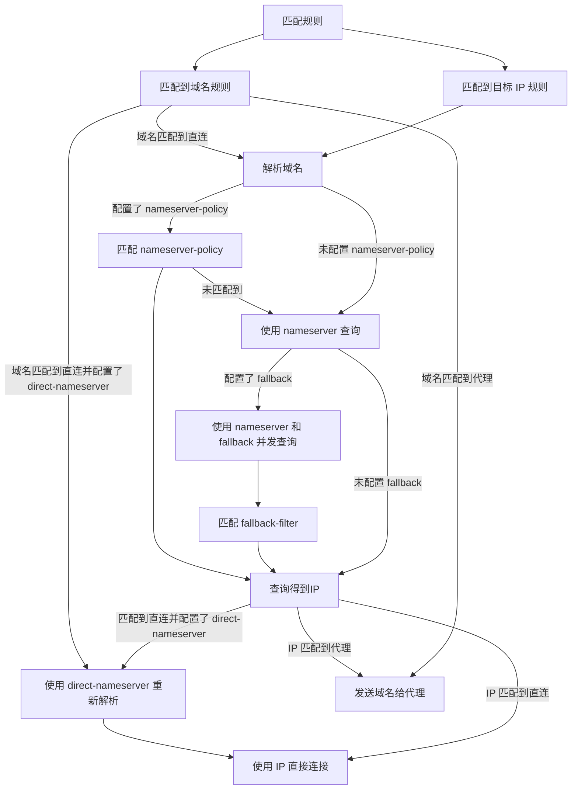

# 虚空终端 Docs 文档目录 (ZH)
- [简介](#简介)- [常见问题](#常见问题)- [使用预编译二进制](#使用预编译二进制)- [客户端](#客户端)- [web面板](#web面板)- [创建运行服务](#创建运行服务)- [三方工具/客户端](#三方工具客户端)- [画饼](#画饼)- [语法](#语法)- [快捷配置](#快捷配置)- [配置](#配置)- [全局配置](#全局配置)- [DNS配置](#dns配置)- [DNS类型](#dns类型)- [hosts](#hosts)- [解析流程](#解析流程)- [域名嗅探](#域名嗅探)- [入站配置](#入站配置)- [代理端口](#代理端口)- [TUN](#tun)- [通用字段](#通用字段)- [HTTP](#http)- [SOCKS](#socks)- [MIXED](#mixed)- [REDIRECT](#redirect)- [TPROXY](#tproxy)- [TUN](#tun)- [ShadowSocks](#shadowsocks)- [VMESS](#vmess)- [VLESS](#vless)- [Trojan](#trojan)- [AnyTLS](#anytls)- [TUIC v4](#tuic-v4)- [TUIC v5](#tuic-v5)- [Hysteria2](#hysteria2)- [TUNNEL](#tunnel)- [通用字段](#通用字段)- [TLS配置](#tls配置)- [传输层配置](#传输层配置)- [dialer-proxy](#dialer-proxy)- [内置代理策略](#内置代理策略)- [DIRECT](#direct)- [DNS](#dns)- [HTTP](#http)- [SOCKS](#socks)- [Shadowsocks](#shadowsocks)- [ShadowsocksR](#shadowsocksr)- [Mieru](#mieru)- [Snell](#snell)- [VMess](#vmess)- [VLESS](#vless)- [Trojan](#trojan)- [AnyTLS](#anytls)- [Hysteria](#hysteria)- [Hysteria2](#hysteria2)- [TUIC](#tuic)- [WireGuard](#wireguard)- [SSH](#ssh)- [代理集合配置](#代理集合配置)- [代理集合内容](#代理集合内容)- [代理组配置](#代理组配置)- [内置代理组](#内置代理组)- [手动选择](#手动选择)- [自动选择](#自动选择)- [自动回退](#自动回退)- [负载均衡](#负载均衡)- [链式代理](#链式代理)- [路由规则](#路由规则)- [规则集合](#规则集合)- [规则集合内容](#规则集合内容)- [子规则](#子规则)- [流量隧道](#流量隧道)- [NTP](#ntp)- [实验性配置](#实验性配置)- [APIs](#apis)
---
# 简介
[**虚空终端**](https://github.com/MetaCubeX/mihomo/tree/Meta) **是一个基于开源项目** [**原神**](https://www.yuanshen.com/) **的二次开发版本，增加了一些独有特性**,[本文档](https://github.com/MetaCubeX/Meta-Docs/)仍在修订中，欢迎 PR。
**使用 虚空终端 前，请悉知：**
* **任何与 [MetaCubeX](https://github.com/MetaCubeX) 无关的下游项目名称中不得包含mihomo一词。**
* 本 Wiki 主要介绍 虚空终端 的特色功能，原神 特性请查看 [**原神 Wiki**](https://wiki.biligame.com/ys/%E9%A6%96%E9%A1%B5)
* 本 Wiki 基于最新的 [**虚空终端**](https://github.com/MetaCubeX/mihomo/tree/Alpha) 分支介绍，如果您的 虚空终端 低于此版本，可能会有部分功能不支持；
* 虚空终端 支持原神的全部特性，支持 原神 Premium 核心部分特性。
---
# 常见问题
(此部分内容 '常见问题' 已被用户选择精简)
---
# 使用预编译二进制
为了开始使用 mihomo, 你可以从以下安装方式中选择一个为当前系统安装 mihomo
## 使用预编译的二进制文件
请在下方选择下载常见的操作系统对应的二进制文件
=== "Windows"
    === "amd64/x86_64"
        <div class="download-list" data-keyword="windows-amd64" data-suffix="zip"><ul>加载中...</ul></div>
    === "386/x86_32"
        <div class="download-list" data-keyword="windows-386" data-suffix="zip"><ul>加载中...</ul></div>
    === "arm64/armv8"
        <div class="download-list" data-keyword="windows-arm64" data-suffix="zip"><ul>加载中...</ul></div>
    === "armv7"
        <div class="download-list" data-keyword="windows-armv7" data-suffix="zip"><ul>加载中...</ul></div>
=== "Linux"
    === "二进制压缩包"
        === "amd64/x86_64"
            <div class="download-list" data-keyword="linux-amd64"data-suffix="gz"><ul>加载中...</ul></div>
        === "386/x86_32"
            <div class="download-list" data-keyword="linux-386"data-suffix="gz"><ul>加载中...</ul></div>
        === "arm64/armv8"
            <div class="download-list" data-keyword="linux-arm64"data-suffix="gz"><ul>加载中...</ul></div>
        === "armv7"
            <div class="download-list" data-keyword="linux-armv7"data-suffix="gz"><ul>加载中...</ul></div>
        === "riscv64"
            <div class="download-list" data-keyword="linux-riscv64"data-suffix="gz"><ul>加载中...</ul></div>
        === "loong64"
            <div class="download-list" data-keyword="linux-loong64"data-suffix="gz"><ul>加载中...</ul></div>
        === "s390x"
            <div class="download-list" data-keyword="linux-s390x"data-suffix="gz"><ul>加载中...</ul></div>
        === "mips"
            <div class="download-list" data-keyword="linux-mips"data-suffix="gz"><ul>加载中...</ul></div>
    === "Debian / DEB"
        === "amd64/x86_64"
            <div class="download-list" data-keyword="linux-amd64"data-suffix="deb"><ul>加载中...</ul></div>
        === "386/x86_32"
            <div class="download-list" data-keyword="linux-386"data-suffix="deb"><ul>加载中...</ul></div>
        === "arm64/armv8"
            <div class="download-list" data-keyword="linux-arm64"data-suffix="deb"><ul>加载中...</ul></div>
        === "armv7"
            <div class="download-list" data-keyword="linux-armv7"data-suffix="deb"><ul>加载中...</ul></div>
        === "riscv64"
            <div class="download-list" data-keyword="linux-riscv64"data-suffix="deb"><ul>加载中...</ul></div>
        === "loong64"
            <div class="download-list" data-keyword="linux-loong64"data-suffix="deb"><ul>加载中...</ul></div>
        === "s390x"
            <div class="download-list" data-keyword="linux-s390x"data-suffix="deb"><ul>加载中...</ul></div>
    === "Redhat / RPM"
        === "amd64/x86_64"
            <div class="download-list" data-keyword="linux-amd64"data-suffix="rpm"><ul>加载中...</ul></div>
        === "386/x86_32"
            <div class="download-list" data-keyword="linux-386"data-suffix="rpm"><ul>加载中...</ul></div>
        === "arm64/armv8"
            <div class="download-list" data-keyword="linux-arm64"data-suffix="rpm"><ul>加载中...</ul></div>
        === "armv7"
            <div class="download-list" data-keyword="linux-armv7"data-suffix="rpm"><ul>加载中...</ul></div>
        === "riscv64"
            <div class="download-list" data-keyword="linux-riscv64"data-suffix="rpm"><ul>加载中...</ul></div>
        === "loong64"
            <div class="download-list" data-keyword="linux-loong64"data-suffix="rpm"><ul>加载中...</ul></div>
        === "s390x"
            <div class="download-list" data-keyword="linux-s390x"data-suffix="rpm"><ul>加载中...</ul></div>
    === "Archlinux / PKG"
        === "amd64/x86_64"
            <div class="download-list" data-keyword="linux-amd64"data-suffix="pkg.tar.zst"><ul>加载中...</ul></div>
        === "386/x86_32"
            <div class="download-list" data-keyword="linux-386"data-suffix="pkg.tar.zst"><ul>加载中...</ul></div>
        === "arm64/armv8"
            <div class="download-list" data-keyword="linux-arm64"data-suffix="pkg.tar.zst"><ul>加载中...</ul></div>
        === "armv7"
            <div class="download-list" data-keyword="linux-armv7"data-suffix="pkg.tar.zst"><ul>加载中...</ul></div>
        === "riscv64"
            <div class="download-list" data-keyword="linux-riscv64"data-suffix="pkg.tar.zst"><ul>加载中...</ul></div>
        === "loong64"
            <div class="download-list" data-keyword="linux-loong64"data-suffix="pkg.tar.zst"><ul>加载中...</ul></div>
        === "s390x"
            <div class="download-list" data-keyword="linux-s390x"data-suffix="pkg.tar.zst"><ul>加载中...</ul></div>
=== "MacOS"
    === "amd64/x86_64"
        <div class="download-list" data-keyword="darwin-amd64" data-suffix="gz"><ul>加载中...</ul></div>
    === "arm64/armv8"
        <div class="download-list" data-keyword="darwin-arm64" data-suffix="gz"><ul>加载中...</ul></div>
=== "FreeBSD"
    === "amd64/x86_64"
        <div class="download-list" data-keyword="freebsd-amd64" data-suffix="gz"><ul>加载中...</ul></div>
    === "386/x86_32"
        <div class="download-list" data-keyword="freebsd-386" data-suffix="gz"><ul>加载中...</ul></div>
    === "arm64/armv8"
        <div class="download-list" data-keyword="freebsd-arm64" data-suffix="gz"><ul>加载中...</ul></div>
=== "Android"
    === "arm64/armv8"
        <div class="download-list" data-keyword="android-arm64" data-suffix="gz"><ul>加载中...</ul></div>
    === "armv7"
        <div class="download-list" data-keyword="android-armv7" data-suffix="gz"><ul>加载中...</ul></div>
    === "amd64/x86_64"
        <div class="download-list" data-keyword="android-amd64" data-suffix="gz"><ul>加载中...</ul></div>
    === "386/x86_32"
        <div class="download-list" data-keyword="android-386" data-suffix="gz"><ul>加载中...</ul></div>
<script>
  const fileList = []
  const divList = document.querySelectorAll('div.download-list')
  const githubLink = 'https://github.com/MetaCubeX/mihomo/releases'

  const getFileList = async () => {
    const link = 'https://api.github.com/repos/MetaCubeX/mihomo/releases/tags/Prerelease-Alpha'
    const { assets } = await fetch(link).then(r => r.json())
    for (const { name, browser_download_url: url } of assets) fileList.push({ name, url })
  }

  getFileList().then(() => {
    for (const div of divList) {
      const keyword = div.getAttribute('data-keyword')
      const suffix = div.getAttribute('data-suffix')
      const ul = div.querySelector('ul')
      ul.innerHTML = ''
      for (const { name, url } of fileList) {
        if (!name.includes(keyword)) continue
        if (!name.includes(suffix)) continue

        const a = document.createElement('a')
        const li = document.createElement('li')
        a.href = url
        a.download = name
        a.innerText = name
        li.appendChild(a)
        ul.appendChild(li)
      }
    }
  }, () => {
    for (const div of divList) {
      const ul = div.querySelector('ul')
      ul.innerHTML = `加载失败，您可以在 github 下载 mihomo 的内核二进制文件： <a href="${githubLink}" target="_blank">github release</a>`
    }
  })
</script>

---
# 客户端
# Client
## Windows
[**Clash.Mini**](https://github.com/MetaCubeX/Clash.Mini)
## Mac OS
[**ClashX.Meta**](https://github.com/MetaCubeX/ClashX.Meta)
## Android
[**Clash.Meta for Android**](https://github.com/MetaCubeX/ClashMetaForAndroid/releases/tag/Prerelease-alpha)

---
# web面板
[Yacd](http://yacd.metacubex.one)
[Metacubexd](http://d.metacubex.one)
[zashboard](http://board.zash.run.place/)

---
# 创建运行服务
## 使用 systemd

- 下载二进制可执行文件 [releases](https://github.com/MetaCubeX/mihomo/releases)

- 将下载的二进制可执行文件重名名为 `mihomo` 并移动到 `/usr/local/bin/`

- 以守护进程的方式，运行 mihomo。
使用以下命令将 mihomo 二进制文件复制到 /usr/local/bin, 配置文件复制到 /etc/mihomo:
```shell
cp mihomo /usr/local/bin
cp config.yaml /etc/mihomo
```
创建 systemd 配置文件 `/etc/systemd/system/mihomo.service`:
```ini
[Unit]
Description=mihomo Daemon, Another Clash Kernel.
After=network.target NetworkManager.service systemd-networkd.service iwd.service
[Service]
Type=simple
LimitNPROC=500
LimitNOFILE=1000000
CapabilityBoundingSet=CAP_NET_ADMIN CAP_NET_RAW CAP_NET_BIND_SERVICE CAP_SYS_TIME CAP_SYS_PTRACE CAP_DAC_READ_SEARCH CAP_DAC_OVERRIDE
AmbientCapabilities=CAP_NET_ADMIN CAP_NET_RAW CAP_NET_BIND_SERVICE CAP_SYS_TIME CAP_SYS_PTRACE CAP_DAC_READ_SEARCH CAP_DAC_OVERRIDE
Restart=always
ExecStartPre=/usr/bin/sleep 1s
ExecStart=/usr/local/bin/mihomo -d /etc/mihomo
ExecReload=/bin/kill -HUP $MAINPID
[Install]
WantedBy=multi-user.target
```
使用以下命令重新加载 systemd:
```shell
systemctl daemon-reload
```
启用 mihomo 服务：
```shell
systemctl enable mihomo
```
使用以下命令立即启动 mihomo:
```shell
systemctl start mihomo
```
使用以下命令使 mihomo 重新加载：
```shell
systemctl reload mihomo
```
使用以下命令检查 mihomo 的运行状况：
```shell
systemctl status mihomo
```
使用以下命令检查 mihomo 的运行日志：
```shell
journalctl -u mihomo -o cat -e
```
或
```shell
journalctl -u mihomo -o cat -f
```

---
# 三方工具/客户端
# 三方工具/客户端
## Windows
|项目名称 | 维护状态 |
|:----|:----|
|[mihomo-party](https://github.com/mihomo-party-org/mihomo-party)|维护中 |
|[clash-verge](https://github.com/MetaCubeX/clash-verge)|停止维护 |
|[clash-verge-rev](https://github.com/clash-verge-rev/clash-verge-rev)|维护中 |
|[clash-nyanpasu](https://github.com/keiko233/clash-nyanpasu)|维护中 |
|[ClashMetaForWindows_Mini](https://github.com/kogekiplay/ClashMetaForWindows_Mini)|停止维护 |
|[clashN](https://github.com/2dust/clashN)|停止维护 |
|[v2rayN](https://github.com/2dust/v2rayN)|维护中 |
|[clashtui](https://github.com/JohanChane/clashtui)|维护中 |
|[GUI.for.Clash](https://github.com/GUI-for-Cores/GUI.for.Clash)|维护中 |
|[FlClash](https://github.com/chen08209/FlClash)|维护中 |
|[Pandora-Box](https://github.com/snakem982/Pandora-Box)|维护中 |
|[mihomo-purity](https://github.com/mihomo-purity/mihomo-purity)|维护中 |
|[mihomosh](https://github.com/SamuNatsu/mihomosh)|维护中 |
## MacOS
|项目名称 | 维护状态 |
|:----|:----|
|[mihomo-party](https://github.com/mihomo-party-org/mihomo-party)|维护中 |
|[clash-verge](https://github.com/MetaCubeX/clash-verge)|停止维护 |
|[clash-verge-rev](https://github.com/clash-verge-rev/clash-verge-rev)|维护中 |
|[clash-nyanpasu](https://github.com/keiko233/clash-nyanpasu)|维护中 |
|[GUI.for.Clash](https://github.com/GUI-for-Cores/GUI.for.Clash)|维护中 |
|[FlClash](https://github.com/chen08209/FlClash)|维护中 |
|[Pandora-Box](https://github.com/snakem982/Pandora-Box)|维护中 |
|[mihomo-purity](https://github.com/mihomo-purity/mihomo-purity)|维护中 |
|[mihomosh](https://github.com/SamuNatsu/mihomosh)|维护中 |
## Linux
|项目名称 | 维护状态 |
|:----|:----|
|[mihomo-party](https://github.com/mihomo-party-org/mihomo-party)|维护中 |
|[clash-verge](https://github.com/MetaCubeX/clash-verge)|停止维护 |
|[clash-verge-rev](https://github.com/clash-verge-rev/clash-verge-rev)|维护中 |
|[clash-nyanpasu](https://github.com/keiko233/clash-nyanpasu)|维护中 |
|[clashtui](https://github.com/JohanChane/clashtui)|维护中 |
|[GUI.for.Clash](https://github.com/GUI-for-Cores/GUI.for.Clash)|维护中 |
|[FlClash](https://github.com/chen08209/FlClash)|维护中 |
|[Pandora-Box](https://github.com/snakem982/Pandora-Box)|维护中 |
|[mihomo-purity](https://github.com/mihomo-purity/mihomo-purity)|维护中 |
|[mihomosh](https://github.com/SamuNatsu/mihomosh)|维护中 |
## Android
|项目名称 | 维护状态 |
|:----|:----|
|[FlClash](https://github.com/chen08209/FlClash)|维护中 |
## Merlin (KoolCenter 固件/paldier SWRT 固件)
|项目名称 | 维护状态 |
|:----|:----|
|[merlinclashcat](https://t.me/merlinclashcat)|维护中|
## OpenWRT
|项目名称 | 维护状态 |
|:----|:----|
|[OpenClash](https://github.com/vernesong/OpenClash)|维护中 |
|[OpenWrt-nikki](https://github.com/nikkinikki-org/OpenWrt-nikki)|维护中 |
|[openwrt-fchomo](https://github.com/fcshark-org/openwrt-fchomo)|维护中|
## Shell
|项目名称 | 维护状态 |
|:----|:----|
|[ShellClash](https://github.com/juewuy/ShellClash)|维护中 |
|[Xray4Magisk](https://github.com/Asterisk4Magisk/Xray4Magisk)|维护中 |
|[Box4](https://github.com/CHIZI-0618/box4magisk)|维护中 |
|[Box for Root](https://github.com/taamarin/box_for_magisk)|维护中 |
|[Surfing](https://github.com/MoGuangYu/Surfing)|维护中 |
|[Clash Tproxy Android](https://t.me/e58695/59)|维护中 |
|[mihomosh](https://github.com/SamuNatsu/mihomosh)|维护中 |
|[Clash.Meta for Magisk](https://t.me/MagiskChangeKing/126)|停止维护 |

---
# 画饼
# 画饼

---
# 语法
# 语法

mihomo 使用 `yaml` 作为配置文件格式
`yaml` 大小写敏感，使用缩进表示层级关系，缩进不允许使用 tab, 只允许空格，缩进的空格数不重要，只要相同层级的元素左对齐即可
## 注释
在 `yaml` 格式的文件中，以"#"作为注释开头，行尾为结尾，"#"必须在行头或者必须在前方有空格，否则不视为注释
```{.yaml linenums="1"}
port: 7890 # http 代理端口
socks-port: 7891
# socks 代理端口
```
## 对象
对象键值对使用冒号结构表示`key: value`,冒号后面要加一个空格，使用缩进表示层级关系
因`yaml`格式为`json`的超集，所以可以直接使用`json`的写法
### 多行
```{.yaml linenums="1"}
tun:
  enable: true
  stack: system
  auto-route: true
  auto-detect-interface: true
```
### 多行 json
```{.yaml linenums="1"}
tun: {
  enable: true,
  stack: system,
  auto-route: true,
  auto-detect-interface: true
  }
```
### 单行 json
```{.yaml linenums="1"}
tun: { enable: true, stack: system, auto-route: true, auto-detect-interface: true}
```
### 全 json
```{.json linenums="1"}
{
  "tun": {
    "enable": true,
    "stack": "system",
    "auto-route": true,
    "auto-detect-interface": true
  }
}
```
## 数组
以`-`开头的行表示构成一个数组，用于一个对象内的多个值
### 多行数组
```{.yaml linenums="1"}
a:
  - b
  - c
  - d
```
### 单行 json 数组
```{.yaml linenums="1"}
a: [b, c, d]
```
## 引用
`&` 锚点和 `*` 别名，可以用来引用，`&` 用来建立锚点，`<<`表示合并到当前数据，`*` 用来引用锚点
如下示例中，因`p`这个键在`mihomo`中不存在，所以在`mihomo`解析配置会被忽视
如合并时有重复的项，则不会去合并
```{.yaml linenums="1"}
p: &p
  type: http
  interval: 3600
  health-check:
    enable: true
    url: https://www.gstatic.com/generate_204
    interval: 300

proxy-providers:
  provider1:
    <<: *p
    url: ""
    path: ./proxy_providers/provider1.yaml

  provider2:
    <<: *p
    type: file
    path: ./proxy_providers/provider2.yaml
```
等同于
```{.yaml linenums="1"}
proxy-providers:
  provider1:
    type: http
    interval: 3600
    health-check:
      enable: true
      url: https://www.gstatic.com/generate_204
      interval: 300
    url: ""
    path: ./proxy_providers/provider1.yaml

  provider2:
    interval: 3600
    health-check:
      enable: true
      url: https://www.gstatic.com/generate_204
      interval: 300
    type: file
    path: ./proxy_providers/provider2.yaml
```
## 域名通配符
### 通配符 `*`

Clash 的通配符 `*` 一次只能匹配一级域名
`*.baidu.com` 只匹配 `tieba.baidu.com` 而不匹配 `123.tieba.baidu.com` 或者 `baidu.com`
`*`只匹配 localhost 等没有`.`的主机名
### 通配符 `+`
通配符 ＋ 类似 DOMAIN-SUFFIX, 可以一次性匹配多个级别
`＋.baidu.com` 匹配 `tieba.baidu.com` 和 `123.tieba.baidu.com` 或者 `baidu.com`
通配符 `＋` 只能用于域名前缀匹配
### 通配符 `.`
通配符 . 可以一次性匹配多个级别
`.baidu.com` 匹配 `tieba.baidu.com` 和 `123.tieba.baidu.com`, 但不能匹配 `baidu.com`
通配符 `.` 只能用于域名前缀匹配
### 使用示例
使用通配符时，应当使用引号 `' '`或 `" "`将内容包裹起来
```{.yaml linenums="1"}
fake-ip-filter:
- ".lan"
- "xbox.*.microsoft.com"
- "+.xboxlive.com"
- localhost.ptlogin2.qq.com
```
## 引入域名集合
!!! warning
    rule-set 仅支持 behavior 为 domain/classical
```{.yaml linenums="1"}
fake-ip-filter:
- "rule-set:xxx"
- "geosite:xxx"
```
## 端口范围

mihomo 可以使用 `-` 来匹配端口范围，使用 `/` 或者 `,` 来区分多个端口/端口范围
### 示例
匹配 114 到 514 和 810 到 1919 端口，以及 65530 端口
```{.yaml linenums="1"}
114-514/810-1919,65530
```
<!--
## 时间格式

mihomo 支持两种时间格式，分别是整数和持续时间
=== "整数格式"
    ```{.yaml linenums="1"}
    interval: 3600
    ```
=== "持续时间格式"
    ```{.yaml linenums="1"}
    interval: 1h
    ```
-->

---
# 快捷配置
=== "GeoX"
    === "config"
        ```{.yaml linenums="1"}
        # url 里填写自己的订阅,名称不能重复
        proxy-providers:
          provider1:
            url: ""
            type: http
            interval: 86400
            health-check: {enable: true,url: "https://www.gstatic.com/generate_204", interval: 300}
            override:
              additional-prefix: "[provider1]"

          provider2:
            url: ""
            type: http
            interval: 86400
            health-check: {enable: true,url: "https://www.gstatic.com/generate_204",interval: 300}
            override:
              additional-prefix: "[provider2]"

        proxies:
          - name: "直连"
            type: direct
            udp: true

        mixed-port: 7890
        ipv6: true
        allow-lan: true
        unified-delay: false
        tcp-concurrent: true
        external-controller: 127.0.0.1:9090
        external-ui: ui
        external-ui-url: "https://github.com/MetaCubeX/metacubexd/archive/refs/heads/gh-pages.zip"

        geodata-mode: true
        geox-url:
          geoip: "https://mirror.ghproxy.com/https://github.com/MetaCubeX/meta-rules-dat/releases/download/latest/geoip-lite.dat"
          geosite: "https://mirror.ghproxy.com/https://github.com/MetaCubeX/meta-rules-dat/releases/download/latest/geosite.dat"
          mmdb: "https://mirror.ghproxy.com/https://github.com/MetaCubeX/meta-rules-dat/releases/download/latest/country-lite.mmdb"
          asn: "https://mirror.ghproxy.com/https://github.com/xishang0128/geoip/releases/download/latest/GeoLite2-ASN.mmdb"

        find-process-mode: strict
        global-client-fingerprint: chrome

        profile:
          store-selected: true
          store-fake-ip: true

        sniffer:
          enable: true
          sniff:
            HTTP:
              ports: [80, 8080-8880]
              override-destination: true
            TLS:
              ports: [443, 8443]
            QUIC:
              ports: [443, 8443]
          skip-domain:
            - "Mijia Cloud"
            - "+.push.apple.com"

        tun:
          enable: true
          stack: mixed
          dns-hijack:
            - "any:53"
            - "tcp://any:53"
          auto-route: true
          auto-redirect: true
          auto-detect-interface: true

        dns:
          enable: true
          ipv6: true
          enhanced-mode: fake-ip
          fake-ip-filter:
            - "*"
            - "+.lan"
            - "+.local"
            - "+.market.xiaomi.com"
          default-nameserver:
            - tls://223.5.5.5
            - tls://223.6.6.6
          nameserver:
            - https://doh.pub/dns-query
            - https://dns.alidns.com/dns-query

        proxy-groups:

          - name: 默认
            type: select
            proxies: [自动选择,直连,香港,台湾,日本,新加坡,美国,其它地区,全部节点]

          - name: Google
            type: select
            proxies: [默认,香港,台湾,日本,新加坡,美国,其它地区,全部节点,自动选择,直连]

          - name: Telegram
            type: select
            proxies: [默认,香港,台湾,日本,新加坡,美国,其它地区,全部节点,自动选择,直连]

          - name: Twitter
            type: select
            proxies: [默认,香港,台湾,日本,新加坡,美国,其它地区,全部节点,自动选择,直连]

          - name: 哔哩哔哩
            type: select
            proxies: [默认,香港,台湾,日本,新加坡,美国,其它地区,全部节点,自动选择,直连]

          - name: 巴哈姆特
            type: select
            proxies: [默认,香港,台湾,日本,新加坡,美国,其它地区,全部节点,自动选择,直连]

          - name: YouTube
            type: select
            proxies: [默认,香港,台湾,日本,新加坡,美国,其它地区,全部节点,自动选择,直连]

          - name: NETFLIX
            type: select
            proxies: [默认,香港,台湾,日本,新加坡,美国,其它地区,全部节点,自动选择,直连]

          - name: Spotify
            type: select
            proxies:  [默认,香港,台湾,日本,新加坡,美国,其它地区,全部节点,自动选择,直连]

          - name: Github
            type: select
            proxies:  [默认,香港,台湾,日本,新加坡,美国,其它地区,全部节点,自动选择,直连]

          - name: 国内
            type: select
            proxies:  [直连,默认,香港,台湾,日本,新加坡,美国,其它地区,全部节点,自动选择]

          - name: 其他
            type: select
            proxies:  [默认,香港,台湾,日本,新加坡,美国,其它地区,全部节点,自动选择,直连]
#分隔,下面是地区分组
          - name: 香港
            type: select
            include-all: true
            exclude-type: direct
            filter: "(?i)港|hk|hongkong|hong kong"

          - name: 台湾
            type: select
            include-all: true
            exclude-type: direct
            filter: "(?i)台|tw|taiwan"

          - name: 日本
            type: select
            include-all: true
            exclude-type: direct
            filter: "(?i)日|jp|japan"

          - name: 美国
            type: select
            include-all: true
            exclude-type: direct
            filter: "(?i)美|us|unitedstates|united states"

          - name: 新加坡
            type: select
            include-all: true
            exclude-type: direct
            filter: "(?i)(新|sg|singapore)"

          - name: 其它地区
            type: select
            include-all: true
            exclude-type: direct
            filter: "(?i)^(?!.*(?:🇭🇰|🇯🇵|🇺🇸|🇸🇬|🇨🇳|港|hk|hongkong|台|tw|taiwan|日|jp|japan|新|sg|singapore|美|us|unitedstates)).*"

          - name: 全部节点
            type: select
            include-all: true
            exclude-type: direct

          - name: 自动选择
            type: url-test
            include-all: true
            exclude-type: direct
            tolerance: 10

        rules:
          - GEOIP,lan,直连,no-resolve
          - GEOSITE,github,Github
          - GEOSITE,twitter,Twitter
          - GEOSITE,youtube,YouTube
          - GEOSITE,google,Google
          - GEOSITE,telegram,Telegram
          - GEOSITE,netflix,NETFLIX
          - GEOSITE,bilibili,哔哩哔哩
          - GEOSITE,bahamut,巴哈姆特
          - GEOSITE,spotify,Spotify
          - GEOSITE,CN,国内
          - GEOSITE,geolocation-!cn,其他

          - GEOIP,google,Google
          - GEOIP,netflix,NETFLIX
          - GEOIP,telegram,Telegram
          - GEOIP,twitter,Twitter
          - GEOIP,CN,国内
          - MATCH,其他
        ```
    === "link"
        ```text
        https://wiki.metacubex.one/example/geox
        ```
=== "RULE-SET"
    === "config"
        ```{.yaml linenums="1"}
        # url 里填写自己的订阅,名称不能重复
        proxy-providers:
          provider1:
            url: ""
            type: http
            interval: 86400
            health-check: {enable: true,url: "https://www.gstatic.com/generate_204",interval: 300}
            override:
              additional-prefix: "[provider1]"

          provider2:
            url: ""
            type: http
            interval: 86400
            health-check: {enable: true,url: "https://www.gstatic.com/generate_204",interval: 300}
            override:
              additional-prefix: "[provider2]"

        proxies:
          - name: "直连"
            type: direct
            udp: true

        mixed-port: 7890
        ipv6: true
        allow-lan: true
        unified-delay: false
        tcp-concurrent: true
        external-controller: 127.0.0.1:9090
        external-ui: ui
        external-ui-url: "https://github.com/MetaCubeX/metacubexd/archive/refs/heads/gh-pages.zip"

        find-process-mode: strict
        global-client-fingerprint: chrome

        profile:
          store-selected: true
          store-fake-ip: true

        sniffer:
          enable: true
          sniff:
            HTTP:
              ports: [80, 8080-8880]
              override-destination: true
            TLS:
              ports: [443, 8443]
            QUIC:
              ports: [443, 8443]
          skip-domain:
            - "Mijia Cloud"
            - "+.push.apple.com"

        tun:
          enable: true
          stack: mixed
          dns-hijack:
            - "any:53"
            - "tcp://any:53"
          auto-route: true
          auto-redirect: true
          auto-detect-interface: true

        dns:
          enable: true
          ipv6: true
          enhanced-mode: fake-ip
          fake-ip-filter:
            - "*"
            - "+.lan"
            - "+.local"
            - "+.market.xiaomi.com"
          default-nameserver:
            - tls://223.5.5.5
            - tls://223.6.6.6
          nameserver:
            - https://doh.pub/dns-query
            - https://dns.alidns.com/dns-query

        proxy-groups:

          - name: 默认
            type: select
            proxies: [自动选择,直连,香港,台湾,日本,新加坡,美国,其它地区,全部节点]

          - name: Google
            type: select
            proxies: [默认,香港,台湾,日本,新加坡,美国,其它地区,全部节点,自动选择,直连]

          - name: Telegram
            type: select
            proxies: [默认,香港,台湾,日本,新加坡,美国,其它地区,全部节点,自动选择,直连]

          - name: Twitter
            type: select
            proxies: [默认,香港,台湾,日本,新加坡,美国,其它地区,全部节点,自动选择,直连]

          - name: 哔哩哔哩
            type: select
            proxies: [默认,香港,台湾,日本,新加坡,美国,其它地区,全部节点,自动选择,直连]

          - name: 巴哈姆特
            type: select
            proxies: [默认,香港,台湾,日本,新加坡,美国,其它地区,全部节点,自动选择,直连]

          - name: YouTube
            type: select
            proxies: [默认,香港,台湾,日本,新加坡,美国,其它地区,全部节点,自动选择,直连]

          - name: NETFLIX
            type: select
            proxies: [默认,香港,台湾,日本,新加坡,美国,其它地区,全部节点,自动选择,直连]

          - name: Spotify
            type: select
            proxies:  [默认,香港,台湾,日本,新加坡,美国,其它地区,全部节点,自动选择,直连]

          - name: Github
            type: select
            proxies:  [默认,香港,台湾,日本,新加坡,美国,其它地区,全部节点,自动选择,直连]

          - name: 国内
            type: select
            proxies:  [直连,默认,香港,台湾,日本,新加坡,美国,其它地区,全部节点,自动选择]

          - name: 其他
            type: select
            proxies:  [默认,香港,台湾,日本,新加坡,美国,其它地区,全部节点,自动选择,直连]
#分隔,下面是地区分组
          - name: 香港
            type: select
            include-all: true
            exclude-type: direct
            filter: "(?i)港|hk|hongkong|hong kong"

          - name: 台湾
            type: select
            include-all: true
            exclude-type: direct
            filter: "(?i)台|tw|taiwan"

          - name: 日本
            type: select
            include-all: true
            exclude-type: direct
            filter: "(?i)日|jp|japan"

          - name: 美国
            type: select
            include-all: true
            exclude-type: direct
            filter: "(?i)美|us|unitedstates|united states"

          - name: 新加坡
            type: select
            include-all: true
            exclude-type: direct
            filter: "(?i)(新|sg|singapore)"

          - name: 其它地区
            type: select
            include-all: true
            exclude-type: direct
            filter: "(?i)^(?!.*(?:🇭🇰|🇯🇵|🇺🇸|🇸🇬|🇨🇳|港|hk|hongkong|台|tw|taiwan|日|jp|japan|新|sg|singapore|美|us|unitedstates)).*"

          - name: 全部节点
            type: select
            include-all: true
            exclude-type: direct

          - name: 自动选择
            type: url-test
            include-all: true
            exclude-type: direct
            tolerance: 10

        rules:
          - RULE-SET,private_ip,直连,no-resolve
          - RULE-SET,github_domain,Github
          - RULE-SET,twitter_domain,Twitter
          - RULE-SET,youtube_domain,YouTube
          - RULE-SET,google_domain,Google
          - RULE-SET,telegram_domain,Telegram
          - RULE-SET,netflix_domain,NETFLIX
          - RULE-SET,bilibili_domain,哔哩哔哩
          - RULE-SET,bahamut_domain,巴哈姆特
          - RULE-SET,spotify_domain,Spotify
          - RULE-SET,cn_domain,国内
          - RULE-SET,geolocation-!cn,其他

          - RULE-SET,google_ip,Google
          - RULE-SET,netflix_ip,NETFLIX
          - RULE-SET,telegram_ip,Telegram
          - RULE-SET,twitter_ip,Twitter
          - RULE-SET,cn_ip,国内
          - MATCH,其他

        rule-anchor:
          ip: &ip {type: http, interval: 86400, behavior: ipcidr, format: mrs}
          domain: &domain {type: http, interval: 86400, behavior: domain, format: mrs}
        rule-providers:
          private_domain:
            <<: *domain
            url: "https://raw.githubusercontent.com/MetaCubeX/meta-rules-dat/meta/geo/geosite/private.mrs"
          cn_domain:
            <<: *domain
            url: "https://raw.githubusercontent.com/MetaCubeX/meta-rules-dat/meta/geo/geosite/cn.mrs"
          biliintl_domain:
            <<: *domain
            url: "https://raw.githubusercontent.com/MetaCubeX/meta-rules-dat/meta/geo/geosite/biliintl.mrs"
          ehentai_domain:
            <<: *domain
            url: "https://raw.githubusercontent.com/MetaCubeX/meta-rules-dat/meta/geo/geosite/ehentai.mrs"
          github_domain:
            <<: *domain
            url: "https://raw.githubusercontent.com/MetaCubeX/meta-rules-dat/meta/geo/geosite/github.mrs"
          twitter_domain:
            <<: *domain
            url: "https://raw.githubusercontent.com/MetaCubeX/meta-rules-dat/meta/geo/geosite/twitter.mrs"
          youtube_domain:
            <<: *domain
            url: "https://raw.githubusercontent.com/MetaCubeX/meta-rules-dat/meta/geo/geosite/youtube.mrs"
          google_domain:
            <<: *domain
            url: "https://raw.githubusercontent.com/MetaCubeX/meta-rules-dat/meta/geo/geosite/google.mrs"
          telegram_domain:
            <<: *domain
            url: "https://raw.githubusercontent.com/MetaCubeX/meta-rules-dat/meta/geo/geosite/telegram.mrs"
          netflix_domain:
            <<: *domain
            url: "https://raw.githubusercontent.com/MetaCubeX/meta-rules-dat/meta/geo/geosite/netflix.mrs"
          bilibili_domain:
            <<: *domain
            url: "https://raw.githubusercontent.com/MetaCubeX/meta-rules-dat/meta/geo/geosite/bilibili.mrs"
          bahamut_domain:
            <<: *domain
            url: "https://raw.githubusercontent.com/MetaCubeX/meta-rules-dat/meta/geo/geosite/bahamut.mrs"
          spotify_domain:
            <<: *domain
            url: "https://raw.githubusercontent.com/MetaCubeX/meta-rules-dat/meta/geo/geosite/spotify.mrs"
          pixiv_domain:
            <<: *domain
            url: "https://raw.githubusercontent.com/MetaCubeX/meta-rules-dat/meta/geo/geosite/pixiv.mrs"
          geolocation-!cn:
            <<: *domain
            url: "https://raw.githubusercontent.com/MetaCubeX/meta-rules-dat/meta/geo/geosite/geolocation-!cn.mrs"

          private_ip:
            <<: *ip
            url: "https://raw.githubusercontent.com/MetaCubeX/meta-rules-dat/meta/geo/geoip/private.mrs"
          cn_ip:
            <<: *ip
            url: "https://raw.githubusercontent.com/MetaCubeX/meta-rules-dat/meta/geo/geoip/cn.mrs"
          google_ip:
            <<: *ip
            url: "https://raw.githubusercontent.com/MetaCubeX/meta-rules-dat/meta/geo/geoip/google.mrs"
          netflix_ip:
            <<: *ip
            url: "https://raw.githubusercontent.com/MetaCubeX/meta-rules-dat/meta/geo/geoip/netflix.mrs"
          twitter_ip:
            <<: *ip
            url: "https://raw.githubusercontent.com/MetaCubeX/meta-rules-dat/meta/geo/geoip/twitter.mrs"
          telegram_ip:
            <<: *ip
            url: "https://raw.githubusercontent.com/MetaCubeX/meta-rules-dat/meta/geo/geoip/telegram.mrs"
        ```
    === "link"
        ```text
        https://wiki.metacubex.one/example/mrs
        ```
=== "Stash(私货)"
    === "config"
        ```{.yaml linenums="1"}
        ######### 锚点 start #######
        # 策略组相关
        pr: &pr {type: select, proxies: [默认, 香港, 香港自动选择, 台湾, 台湾自动选择, 日本, 日本自动选择, 新加坡, 新加坡自动选择, 美国, 美国自动选择, 其它地区, 全部节点, 自动选择, 直连]}
        #这里是订阅更新和延迟测试相关的
        p: &p {type: http, interval: 3600, health-check: {enable: true, url: "https://www.gstatic.com/generate_204", interval: 300}}
        ######### 锚点 end #######
# url 里填写自己的订阅,名称不能重复
        proxy-providers:
          provider1:
            <<: *p
            url: ""
          provider2:
            <<: *p
            url: ""
        ipv6: true
        allow-lan: true
        mixed-port: 7890
        external-controller: 127.0.0.1:9090
        profile:
          store-selected: true
          store-fake-ip: true
        dns:
          enable: true
          ipv6: true
          enhanced-mode: fake-ip
          fake-ip-range: 28.0.0.1/8
          fake-ip-filter:
            - "*"
            - "+.lan"
            - "+.local"
          default-nameserver:
            - 223.5.5.5
          nameserver:
            - https://doh.pub/dns-query
            - https://dns.alidns.com/dns-query

        proxies:
        - name: "直连"
          type: direct
          udp: true
        proxy-groups:
        - {name: 默认, type: select, proxies: [自动选择, 直连, 香港, 香港自动选择, 台湾, 台湾自动选择, 日本, 日本自动选择, 新加坡, 新加坡自动选择, 美国, 美国自动选择, 其它地区, 全部节点], icon: "https://raw.githubusercontent.com/Koolson/Qure/master/IconSet/mini/Proxy.png"}
        - {name: Google, <<: *pr, icon: "https://raw.githubusercontent.com/Koolson/Qure/master/IconSet/mini/Google_Search.png"}
        - {name: Apple, <<: *pr, icon: https://raw.githubusercontent.com/Koolson/Qure/master/IconSet/mini/Apple.png}
        - {name: Telegram, <<: *pr, icon: "https://raw.githubusercontent.com/Koolson/Qure/master/IconSet/mini/Telegram.png"}
        - {name: Twitter, <<: *pr, icon: "https://raw.githubusercontent.com/Koolson/Qure/master/IconSet/mini/Twitter.png"}
        - {name: ehentai, <<: *pr, icon: "https://raw.githubusercontent.com/Koolson/Qure/master/IconSet/mini/Panda.png"}
        - {name: 哔哩哔哩, <<: *pr, icon: "https://raw.githubusercontent.com/Koolson/Qure/master/IconSet/mini/bilibili.png"}
        - {name: 哔哩东南亚, <<: *pr, icon: "https://raw.githubusercontent.com/Koolson/Qure/master/IconSet/mini/bilibili.png"}
        - {name: 巴哈姆特, <<: *pr, icon: "https://raw.githubusercontent.com/Koolson/Qure/master/IconSet/mini/Bahamut.png"}
        - {name: YouTube, <<: *pr, icon: "https://raw.githubusercontent.com/Koolson/Qure/master/IconSet/mini/YouTube.png"}
        - {name: NETFLIX, <<: *pr, icon: "https://raw.githubusercontent.com/Koolson/Qure/master/IconSet/mini/Netflix.png"}
        - {name: Spotify, <<: *pr, icon: "https://raw.githubusercontent.com/Koolson/Qure/master/IconSet/mini/Spotify.png"}
        - {name: 国内, type: select, proxies: [直连, 默认, 香港, 香港自动选择, 台湾, 台湾自动选择, 日本, 日本自动选择, 新加坡, 新加坡自动选择, 美国, 美国自动选择, 其它地区, 全部节点, 自动选择], icon: "https://raw.githubusercontent.com/Koolson/Qure/master/IconSet/mini/China_Map.png"}
        - {name: 其他, <<: *pr, icon: "https://raw.githubusercontent.com/Koolson/Qure/master/IconSet/mini/Final.png"}
          #分隔,下面是地区分组
        - {name: 香港, type: select, include-all: true, filter: "(?i)(?!直连)(港|hk|hongkong|hong kong)", icon: "https://raw.githubusercontent.com/Koolson/Qure/master/IconSet/mini/HK.png"}
        - {name: 台湾, type: select, include-all: true, filter: "(?i)(?!直连)(台|tw|taiwan)", icon: "https://raw.githubusercontent.com/Koolson/Qure/master/IconSet/mini/TW.png"}
        - {name: 日本, type: select, include-all: true, filter: "(?i)(?!直连)(日|jp|japan)", icon: "https://raw.githubusercontent.com/Koolson/Qure/master/IconSet/mini/JP.png"}
        - {name: 美国, type: select, include-all: true, filter: "(?i)(?!直连)(美|us|unitedstates|united states)", icon: "https://raw.githubusercontent.com/Koolson/Qure/master/IconSet/mini/US.png"}
        - {name: 新加坡, type: select, include-all: true, filter: "(?i)(?!直连)(新|sg|singapore)", icon: "https://raw.githubusercontent.com/Koolson/Qure/master/IconSet/mini/SG.png"}
        - {name: 其它地区, type: select, include-all: true, filter: "(?i)^(?!.*(?:🇭🇰|🇯🇵|🇺🇸|🇸🇬|🇨🇳|港|hk|hongkong|台|tw|taiwan|日|jp|japan|新|sg|singapore|美|us|unitedstates|直连)).*", icon: "https://raw.githubusercontent.com/Koolson/Qure/master/IconSet/mini/Available.png"}
        - {name: 自动选择, type: url-test, include-all: true, tolerance: 10, icon: "https://raw.githubusercontent.com/Koolson/Qure/master/IconSet/mini/Auto.png"}
        - {name: 全部节点, type: select, include-all: true, icon: "https://raw.githubusercontent.com/Koolson/Qure/master/IconSet/mini/Global.png"}

        - {name: 香港自动选择,type: url-test, include-all: true, filter: "(?i)(?!直连)(港|hk|hongkong|hong kong)", icon: "https://raw.githubusercontent.com/Koolson/Qure/master/IconSet/mini/HK.png"}
        - {name: 台湾自动选择,type: url-test, include-all: true, filter: "(?i)(?!直连)(台|tw|taiwan)", icon: "https://raw.githubusercontent.com/Koolson/Qure/master/IconSet/mini/TW.png"}
        - {name: 日本自动选择,type: url-test, include-all: true, filter: "(?i)(?!直连)(日|jp|japan)", icon: "https://raw.githubusercontent.com/Koolson/Qure/master/IconSet/mini/JP.png"}
        - {name: 美国自动选择,type: url-test, include-all: true, filter: "(?i)(?!直连)(美|us|unitedstates|united states)", icon: "https://raw.githubusercontent.com/Koolson/Qure/master/IconSet/mini/US.png"}
        - {name: 新加坡自动选择,type: url-test, include-all: true, filter: "(?i)(新|sg|singapore)", icon: "https://raw.githubusercontent.com/Koolson/Qure/master/IconSet/mini/SG.png"}

        rules:
        - GEOIP,lan,直连,no-resolve
        - RULE-SET,biliintl_domain,哔哩东南亚
        - RULE-SET,ehentai_domain,ehentai
        - RULE-SET,github_domain,其他
        - RULE-SET,twitter_domain,Twitter
        - RULE-SET,youtube_domain,YouTube
        - RULE-SET,google_domain,Google
        - RULE-SET,telegram_domain,Telegram
        - RULE-SET,netflix_domain,NETFLIX
        - RULE-SET,bilibili_domain,哔哩哔哩
        - RULE-SET,bahamut_domain,巴哈姆特
        - RULE-SET,spotify_domain,Spotify
        - RULE-SET,pixiv_domain,其他
        - RULE-SET,geolocation-!cn,其他

        - RULE-SET,google_ip,Google
        - RULE-SET,netflix_ip,NETFLIX
        - RULE-SET,telegram_ip,Telegram
        - RULE-SET,twitter_ip,Twitter
        - RULE-SET,cn_domain,国内
        - RULE-SET,cn_ip,国内
        - MATCH,其他

        rule-anchor:
          ip: &ip {type: http, interval: 86400, behavior: ipcidr, format: text}
          domain: &domain {type: http, interval: 86400, behavior: domain, format: text}
        rule-providers:
          private:
            <<: *domain
            url: "https://raw.githubusercontent.com/MetaCubeX/meta-rules-dat/meta/geo/geosite/private.list"
          cn_domain:
            <<: *domain
            url: "https://raw.githubusercontent.com/MetaCubeX/meta-rules-dat/meta/geo/geosite/cn.list"
          biliintl_domain:
            <<: *domain
            url: "https://raw.githubusercontent.com/MetaCubeX/meta-rules-dat/meta/geo/geosite/biliintl.list"
          ehentai_domain:
            <<: *domain
            url: "https://raw.githubusercontent.com/MetaCubeX/meta-rules-dat/meta/geo/geosite/ehentai.list"
          github_domain:
            <<: *domain
            url: "https://raw.githubusercontent.com/MetaCubeX/meta-rules-dat/meta/geo/geosite/github.list"
          twitter_domain:
            <<: *domain
            url: "https://raw.githubusercontent.com/MetaCubeX/meta-rules-dat/meta/geo/geosite/twitter.list"
          youtube_domain:
            <<: *domain
            url: "https://raw.githubusercontent.com/MetaCubeX/meta-rules-dat/meta/geo/geosite/youtube.list"
          google_domain:
            <<: *domain
            url: "https://raw.githubusercontent.com/MetaCubeX/meta-rules-dat/meta/geo/geosite/google.list"
          telegram_domain:
            <<: *domain
            url: "https://raw.githubusercontent.com/MetaCubeX/meta-rules-dat/meta/geo/geosite/telegram.list"
          netflix_domain:
            <<: *domain
            url: "https://raw.githubusercontent.com/MetaCubeX/meta-rules-dat/meta/geo/geosite/netflix.list"
          bilibili_domain:
            <<: *domain
            url: "https://raw.githubusercontent.com/MetaCubeX/meta-rules-dat/meta/geo/geosite/bilibili.list"
          bahamut_domain:
            <<: *domain
            url: "https://raw.githubusercontent.com/MetaCubeX/meta-rules-dat/meta/geo/geosite/bahamut.list"
          spotify_domain:
            <<: *domain
            url: "https://raw.githubusercontent.com/MetaCubeX/meta-rules-dat/meta/geo/geosite/spotify.list"
          pixiv_domain:
            <<: *domain
            url: "https://raw.githubusercontent.com/MetaCubeX/meta-rules-dat/meta/geo/geosite/pixiv.list"
          geolocation-!cn:
            <<: *domain
            url: "https://raw.githubusercontent.com/MetaCubeX/meta-rules-dat/meta/geo/geosite/geolocation-!cn.list"

          cn_ip:
            <<: *ip
            url: "https://raw.githubusercontent.com/MetaCubeX/meta-rules-dat/meta/geo/geoip/cn.list"
          google_ip:
            <<: *ip
            url: "https://raw.githubusercontent.com/MetaCubeX/meta-rules-dat/meta/geo/geoip/google.list"
          netflix_ip:
            <<: *ip
            url: "https://raw.githubusercontent.com/MetaCubeX/meta-rules-dat/meta/geo/geoip/netflix.list"
          twitter_ip:
            <<: *ip
            url: "https://raw.githubusercontent.com/MetaCubeX/meta-rules-dat/meta/geo/geoip/twitter.list"
          telegram_ip:
            <<: *ip
            url: "https://raw.githubusercontent.com/MetaCubeX/meta-rules-dat/meta/geo/geoip/telegram.list"
        ```
    === "link"
        ```text
        https://wiki.metacubex.one/example/stash
        ```

---
# 配置
# 配置
<div class="grid cards" markdown>

- :octicons-file-code-24: &nbsp; __[完整示例][example]__

    test

- :material-login: &nbsp; __[流量入站][inbound]__

    test

- :material-shuffle-variant: &nbsp; __[路由规则][rule]__

    test

- :material-logout: &nbsp; __[出站代理][proxie]__

    test

- :material-dns-outline: &nbsp; __[DNS][dns]__

    test

- :material-format-list-group: &nbsp; __[策略组][proxy-group]__

    test
</div>
[example]: https://github.com/MetaCubeX/mihomo/blob/Meta/docs/config.yaml
[inbound]: ./inbound/index.md
[proxy-group]: ./proxy-groups/index.md
[proxie]: ./proxies/index.md
[rule]: ./rules/index.md
[dns]: ./dns/index.md

---
# 全局配置
# 全局配置
## 允许局域网
允许其他设备经过 Clash 的[代理端口](./inbound/port.md)访问互联网
可选值 `true/false`
```{.yaml linenums="1"}
allow-lan: true
```
绑定地址，仅允许其他设备通过这个地址访问
***`"*"`*** 绑定所有 IP 地址
***`192.168.31.31`*** 绑定单个 IPV4 地址
***`[aaaa::a8aa:ff:fe09:57d8]`*** 绑定单个 IPV6 地址
```{.yaml linenums="1"}
bind-address: "*"
```
允许连接的 IP 地址段，仅作用于 `allow-lan` 为 `true`
默认值为 `0.0.0.0/0`和 `::/0`
```{.yaml linenums="1"}
lan-allowed-ips:
- 0.0.0.0/0
- ::/0
```
禁止连接的 IP 地址段，黑名单优先级高于白名单，默认值为空
```{.yaml linenums="1"}
lan-disallowed-ips:
- 192.168.0.3/32
```
### 用户验证
`http(s)`/`socks`/`mixed`代理的用户验证
```{.yaml linenums="1"}
authentication:
- "user1:pass1"
- "user2:pass2"
```
设置允许跳过验证的 IP 段
```{.yaml linenums="1"}
skip-auth-prefixes:
- 127.0.0.1/8
- ::1/128
```
## 运行模式
* ***`rule`*** 规则匹配
* ***`global`*** 全局代理 (需要在 GLOBAL 策略组选择代理/策略)
* ***`direct`*** 全局直连
此项拥有默认值，默认为规则模式
```{.yaml linenums="1"}
mode: rule
```
## 日志级别

Clash 内核输出日志的等级，仅在控制台和控制页面输出
```{.yaml linenums="1"}
log-level: info
```
* ***`silent`*** 静默，不输出
* ***`error`*** 仅输出发生错误至无法使用的日志
* ***`warning`*** 输出发生错误但不影响运行的日志，以及 error 级别内容
* ***`info`*** 输出一般运行的内容，以及 error 和 warning 级别的日志
* ***`debug`*** 尽可能的输出运行中所有的信息
## IPv6
是否允许内核接受 IPv6 流量
可选值 `true/false,`默认为 `true`
```{.yaml linenums="1"}
ipv6: true
```
## TCP Keep Alive 设置
修改此项以减少移动设备[耗电问题](https://github.com/vernesong/OpenClash/issues/2614)

TCP Keep Alive 包的间隔，单位为秒
```{.yaml linenums="1"}
keep-alive-interval: 15
```

TCP Keep Alive 的最大空闲时间
```{.yaml linenums="1"}
keep-alive-idle: 15
```
禁用 TCP Keep Alive，在 Android 默认为 true
```{.yaml linenums="1"}
disable-keep-alive: false
```
## 进程匹配模式
控制是否让 Clash 去匹配进程
* ***`always`*** 开启，强制匹配所有进程
* ***`strict`*** 默认，由 Clash 判断是否开启
* ***`off`*** 不匹配进程，推荐在路由器上使用此模式
```{.yaml linenums="1"}
find-process-mode: strict
```
## 外部控制 (API)
外部控制器，可以使用 RESTful API 来控制你的 Clash 内核

API 监听地址，你可以将 127.0.0.1 修改为 0.0.0.0 来监听所有 IP
```{.yaml linenums="1"}
external-controller: 127.0.0.1:9090
```

API CORS 标头配置
```{.yaml linenums="1"}
external-controller-cors:
  allow-origins:
    - '*'
  allow-private-network: true
```

Unix socket API 监听地址
!!! warning ""
    从Unix socket访问api接口不会验证secret， 如果开启请自行保证安全问题
```{.yaml linenums="1"}
external-controller-unix: mihomo.sock
```

Windows namedpipe API 监听地址
!!! warning ""
    从Windows namedpipe访问api接口不会验证secret， 如果开启请自行保证安全问题
```{.yaml linenums="1"}
external-controller-pipe: \\.\pipe\mihomo
```

HTTPS-API 监听地址，需要配置 `tls` 部分证书和其私钥配置，使用 TLS 也必须填写 `external-controller`
```{.yaml linenums="1"}
external-controller-tls: 127.0.0.1:9443
```
在 RESTful API 端口上开启 DOH 服务器
!!! warning ""
    该URL不会验证secret， 如果开启请自行保证安全问题
```{.yaml linenums="1"}
external-doh-server: /dns-query
```

API 的访问密钥
```{.yaml linenums="1"}
secret: ""
```
## 外部用户界面
可以将静态网页资源 (比如 Clash-dashboard) 运行在 Clash API, 路径为 API 地址/ui
```{.yaml linenums="1"}
external-ui: /path/to/ui/folder
```
可以为绝对路径，或者 Clash 工作目录的相对路径
!!! note
    注意，如果路径不在 Clash 工作目录，请手动设置`SAFE_PATHS`环境变量将其加入安全路径，该环境变量的语法同本操作系统的PATH环境变量解析规则（即Windows下以分号分割，其他系统下以冒号分割）。
## 自定义外部用户界面名字
```{.yaml linenums="1"}
external-ui-name: xd      #  合并为 external-ui/xd
```
非必须，更新时会更新到指定文件夹，不配置则直接更新到 external-ui 目录
## 自定义外部用户界面下载地址
```{.yaml linenums="1"}
external-ui-url: "https://github.com/MetaCubeX/metacubexd/archive/refs/heads/gh-pages.zip" #从 GitHub Pages 分支获取
```
## 缓存
```{.yaml linenums="1"}
profile:
  store-selected: true
  # 储存 API 对策略组的选择，以供下次启动时使用
  store-fake-ip: true
  # 储存 fakeip 映射表，域名再次发生连接时，使用原有映射地址
```
## 统一延迟
开启统一延迟时，会计算 RTT，以消除连接握手等带来的不同类型节点的延迟差异
可选值 `true/false`
```{.yaml linenums="1"}
unified-delay: true
```
## TCP 并发
可选值 `true/false`
```{.yaml linenums="1"}
tcp-concurrent: true
```
## 出站接口

Clash 的流量出站接口
```{.yaml linenums="1"}
interface-name: en0
```
## 路由标记
为 Linux 下的出站连接提供默认流量标记
```{.yaml linenums="1"}
routing-mark: 6666
```
## TLS
目前仅用于 API 的 https
```{.yaml linenums="1"}
tls:
  certificate: string # 证书 PEM 格式，或者 证书的路径
  private-key: string # 证书对应的私钥 PEM 格式，或者私钥路径
```
## 全局客户端指纹
全局 TLS 指纹，优先低于 proxy 内的 client-fingerprint。
目前支持开启 TLS 传输的 TCP/grpc/WS/HTTP , 支持协议有 VLESS,Vmess 和 trojan.
```{.yaml linenums="1"}
global-client-fingerprint: chrome
```
!!! note
    可选：`chrome`, `firefox`, `safari`, `iOS`, `android`, `edge`, `360`, `qq`, `random`, 若选择 `random`, 则按 Cloudflare Radar 数据按概率生成一个现代浏览器指纹。
## GEOIP 数据模式
更改 geoip 使用文件，mmdb 或者 dat，可选 `true`/`false`,`true`为 dat，此项有默认值 `false`
```{.yaml linenums="1"}
geodata-mode: true
```
## GEO 文件加载模式
可选的加载模式如下
* `standard`：标准加载器
* `memconservative`：专为内存受限 (小内存) 设备优化的加载器 (默认值)
```{.yaml linenums="1"}
geodata-loader: memconservative
```
## 自动更新 GEO
```{.yaml linenums="1"}
geo-auto-update: false
```
更新间隔，单位为小时
```{.yaml linenums="1"}
geo-update-interval: 24
```
## 自定 GEO 下载地址
```{.yaml linenums="1"}
geox-url:
  geoip: "https://testingcf.jsdelivr.net/gh/MetaCubeX/meta-rules-dat@release/geoip.dat"
  geosite: "https://testingcf.jsdelivr.net/gh/MetaCubeX/meta-rules-dat@release/geosite.dat"
  mmdb: "https://testingcf.jsdelivr.net/gh/MetaCubeX/meta-rules-dat@release/country.mmdb"
  asn: "https://github.com/xishang0128/geoip/releases/download/latest/GeoLite2-ASN.mmdb"
```
## 自定全局 UA
自定义外部资源下载时使用的的 UA，默认为 `clash.meta`
```{.yaml linenums="1"}
global-ua: clash.meta
```
## ETag 支持
外部资源下载的 ETag 支持，默认为 `true`
```{.yaml linenums="1"}
etag-support: true
```

---
# DNS配置
# DNS
```{.yaml linenums="1"}
dns:
  enable: true
  cache-algorithm: arc
  prefer-h3: false
  use-hosts: true
  use-system-hosts: true
  respect-rules: false
  listen: 0.0.0.0:1053
  ipv6: false
  default-nameserver:
    - 223.5.5.5
  enhanced-mode: fake-ip
  fake-ip-range: 198.18.0.1/16
  fake-ip-filter-mode: blacklist
  fake-ip-filter:
    - '*.lan'
  nameserver-policy:
    '+.arpa': '10.0.0.1'
    'rule-set:cn':
    - https://doh.pub/dns-query
    - https://dns.alidns.com/dns-query
  nameserver:
    - https://doh.pub/dns-query
    - https://dns.alidns.com/dns-query
  fallback:
    - tls://8.8.4.4
    - tls://1.1.1.1
  proxy-server-nameserver:
    - https://doh.pub/dns-query
  direct-nameserver:
    - system
  direct-nameserver-follow-policy: false
  fallback-filter:
    geoip: true
    geoip-code: CN
    geosite:
      - gfw
    ipcidr:
      - 240.0.0.0/4
    domain:
      - '+.google.com'
      - '+.facebook.com'
      - '+.youtube.com'
```
## enable
是否启用，如为 false，则使用系统 DNS 解析
## cache-algorithm
支持的算法：

- lru: Least Recently Used, 默认值
- arc: Adaptive Replacement Cache
## prefer-h3

DOH 优先使用 http/3
## listen

DNS 服务监听，支持 udp, tcp
## IPV6
是否解析 IPV6, 如为 false, 则回应 AAAA 的空解析
## enhanced-mode
可选值 `fake-ip`/`redir-host`，默认`redir-host`

mihomo 的 DNS 处理模式
## fake-ip-range

fakeip 下的 IP 段设置，[tun](../inbound/tun.md) 的默认 IPV4 地址 也使用此值作为参考
## fake-ip-filter

fakeip 过滤，以下地址不会下发 fakeip 映射用于连接
值支持[域名通配](../../handbook/syntax.md#_8)以及[引入域名集合](../../handbook/syntax.md#_13)
## fake-ip-filter-mode: blacklist
可选 `blacklist`/`whitelist`，默认`blacklist`，`whitelist` 即只有匹配成功才返回 fake-ip
## use-hosts
是否回应配置中的 [hosts](./hosts.md)，默认 true
## use-system-hosts
是否查询系统 hosts，默认 true
## respect-rules

dns 连接遵守[路由规则](../rules/index.md)，需配置 [proxy-server-nameserver](./index.md#proxy-server-nameserver)
!!! note ""
    强烈不建议和 `prefer-h3` 一起使用
## default-nameserver
默认 DNS, 用于解析 DNS 服务器 的域名
!!! note ""
    必须为 IP, 可为加密 DNS
## nameserver-policy
指定域名查询的解析服务器，可使用 geosite, 优先于 `nameserver/fallback 查询`
键支持[域名通配](../../handbook/syntax.md#_8)
值支持字符串/数组
## proxy-server-nameserver
代理节点域名解析服务器，仅用于解析代理节点的域名，如果不填则遵循 nameserver-policy、nameserver 和 fallback 的配置
## direct-nameserver
用于 direct 出口域名解析的 DNS 服务器，如果不填则遵循 nameserver-policy、nameserver 和 fallback 的配置
## direct-nameserver-follow-policy
是否遵循 nameserver-policy，默认为不遵守，仅当 direct-nameserver 不为空时生效
## nameserver
默认的域名解析服务器
## fallback
后备域名解析服务器，一般情况下使用境外 DNS, 保证结果可信
配置 `fallback`后默认启用 `fallback-filter`,`geoip-code`为 cn
## fallback-filter
后备域名解析服务器筛选，满足条件的将使用 `fallback`结果或只使用 `fallback`解析
### geoip
是否启用 geoip 判断
### geoip-code
可选值为 国家缩写，默认值为 `CN`
除了 `geoip-code` 配置的国家 IP, 其他的 IP 结果会被视为污染
`geoip-code` 配置的国家的结果会直接采用，否则将采用 `fallback`结果
### geosite
可选值为对于的 geosite 内包含的集合

geosite 列表的内容被视为已污染，匹配到 geosite 的域名，将只使用 `fallback`解析，不去使用 `nameserver`
### ipcidr
书写内容为 `IP/掩码`
这些网段的结果会被视为污染，`nameserver`解析出这些结果时将会采用 `fallback`的解析结果
### domain
这些域名被视为已污染，匹配到这些域名，会直接使用 `fallback`解析，不去使用 `nameserver`
## 附加参数
此部分可用于发向公网地址的 DNS 服务器，使用`#`附加，使用`&`连接不同的参数。
支持范围：
|              | [nameserver](./index.md#nameserver) | [fallback](./index.md#fallback) | [nameserver-policy](./index.md#nameserver-policy) | [proxy-server-nameserver](./index.md#proxy-server-nameserver) | [direct-nameserver](./index.md#direct-nameserver) | [default-nameserver](./index.md#default-nameserver) | [WireGuard.dns](../proxies/wg.md#dns) |
|--------------|---------------------------|-------------------|---------------------|-------------------------|---------------------|----------------------|------------------------------------|
| 指定代理/接口      | ✓                         | ✓                 | ✓                   | ✓                       | ✓                   | ✓                    | ✓                                  |
| 强制 HTTP/3    | DOH                       | DOH               | DOH                 | DOH                     | DOH                 | DOH                  | DOH                                |
| 跳过证书验证       | DOH                       | DOH               | DOH                 | DOH                     | DOH                 | DOH                  | DOH                                |
| ecs          | DOH                       | DOH               | DOH                 | DOH                     | DOH                 | DOH                  | DOH                                |
| ecs-override | DOH                       | DOH               | DOH                 | DOH                     | DOH                 | DOH                  | DOH                                |
> 以上表格中的 `✓` 表示支持[所有的类型](./type.md)
### DNS 指定 代理/接口 进行连接
优先使用已有代理，如果不存在该名称的代理则指定接口连接
`#RULES`为遵守路由规则进行连接，等同于[respect-rules](./index.md#respect-rules)
如需经过代理查询，应配置 `proxy-server-nameserver`, 以防出现鸡蛋问题
```{.yaml linenums="1"}
nameserver:
  - 'tls://dns.google#proxy'
  - 'tls://dns.alidns.com#eth0'
```
### 强制 HTTP/3
此选项与 `prefer-h3` 不冲突，填写后强制启用 HTTP/3 建立 DOH 连接，使用前需确保 DOH 服务器支持 HTTP/3
```{.yaml linenums="1"}
nameserver:
  - 'https://dns.cloudflare.com/dns-query#h3=true'
```
### doh 跳过证书验证
```{.yaml linenums="1"}
nameserver:
  - 'https://dns.cloudflare.com/dns-query#skip-cert-verify=true'
```
### ecs
指定 dns 查询的 subnet 地址，仅支持 [doh](./type.md#dns-over-https)
```
nameserver:
  - 'https://8.8.8.8/dns-query#ecs=1.1.1.1/24'
```
### ecs-override
强制覆盖 dns 查询的 subnet 地址，仅支持 [doh](./type.md#dns-over-https)
```
nameserver:
  - 'https://8.8.8.8/dns-query#ecs=1.1.1.1/24&ecs-override=true'
```

---
# DNS类型
# 支持的类型
## UDP
```{.yaml linenums="1"}
- 223.5.5.5
- udp://223.5.5.5
```
## TCP
```{.yaml linenums="1"}
- tcp://8.8.8.8
```
## DNS over TLS
```{.yaml linenums="1"}
- tls://1.1.1.1
```
## DNS over HTTPS
```{.yaml linenums="1"}
- https://doh.pub/dns-query
```
## DNS over QUIC
```{.yaml linenums="1"}
- quic://dns.adguard.com:784
```
## system
```{.yaml linenums="1"}
- system://
- system
```
## dhcp
```{.yaml linenums="1"}
- dhcp://en0
```
仅限 cmfa，使用系统 dns
```{.yaml linenums="1"}
- dhcp://system
```
## rcode
```{.yaml linenums="1"}
- rcode://success            # No error
- rcode://format_error       # Format error
- rcode://server_failure     # Server failure
- rcode://name_error         # Non-existent domain
- rcode://not_implemented    # Not implemented
- rcode://refused            # Query refused
```

---
# hosts
# hosts
```{.yaml linenums="1"}
hosts:
  '*.clash.dev': 127.0.0.1
  'alpha.clash.dev': '::1'
  test.com: [1.1.1.1, 2.2.2.2]
  baidu.com: google.com
```
键支持[域名通配](../../handbook/syntax.md#_8)
值支持字符串/数组，域名重定向不支持数组
!!! note
    完整的的域名优先级高于使用通配符的域名，例如：foo.example.com > \*.example.com > .example.com

---
# 解析流程
# 解析流程
## 示例配置
```{.yaml linenums="1"}
dns:
  nameserver:
    - https://doh.pub/dns-query
  fallback:
    - https://8.8.8.8/dns-query
  direct-nameserver:
    - system
  nameserver-policy:
    "geosite:cn,private":
    - https://doh.pub/dns-query
    - https://dns.alidns.com/dns-query
  fallback-filter:
    geoip: true
    geoip-code: CN
    geosite:
      - gfw
    ipcidr:
      - 240.0.0.0/4
    domain:
      - '+.google.com'
      - '+.facebook.com'
      - '+.youtube.com'

rules:
- DOMAIN-SUFFIX,google.com,PROXY
- GEOIP,CN,DIRECT
- MATCH,PROXY
```
## 流程
!!! note ""
    此部分仅说明 dns 模块的处理过程
!!! warning ""
    direct-nameserver 重新解析仅限 tcp 连接


---
# 域名嗅探
# 域名嗅探
```{.yaml linenums="1"}
sniffer:
  enable: false
  force-dns-mapping: true
  parse-pure-ip: true
  override-destination: false
  sniff:
    HTTP:
      ports: [80, 8080-8880]
      override-destination: true
    TLS:
      ports: [443, 8443]
    QUIC:
      ports: [443, 8443]
  force-domain:
    - +.v2ex.com
  skip-domain:
    - Mijia Cloud
  skip-src-address:
    - 192.168.0.3/32
  skip-dst-address:
    - 192.168.0.3/32
```
## enable
是否启用 sniffer
## force-dns-mapping
对 `redir-host` 类型识别的流量进行强制嗅探
## parse-pure-ip
对所有未获取到域名的流量进行强制嗅探
## override-destination
是否使用嗅探结果作为实际访问，默认为 true
## sniff
需要嗅探的协议设置，仅支持 `HTTP`/`TLS`/`QUIC`

- `ports`: [端口范围](../../handbook/syntax.md#_14)
- `override-destination`: 覆盖全局`override-destination`设置
## force-domain
强制进行嗅探的域名列表，使用[域名通配](../../handbook/syntax.md#_8)
## skip-domain
跳过嗅探的域名列表，使用[域名通配](../../handbook/syntax.md#_8)
## skip-src-address
跳过嗅探的来源 IP 段列表
## skip-dst-address
跳过嗅探的目标 IP 段列表

---
# 入站配置

Clash.Meta 使用流量入站，可以作为服务器。
## 局域网入站
用于监听局域网流量的入站，适用于无加密传输：
```{.yaml linenums="1"}
listeners:
  - name: socks5-in-1
    type: socks
    port: 10808
    #listen: 0.0.0.0 # 默认监听 0.0.0.0
    # rule: sub-rule-name1 # 默认使用 rules,如果未找到 sub-rule 则直接使用 rules
    # proxy: proxy # 如果不为空则直接将该入站流量交由指定proxy处理
    # udp: false # 默认 true

  - name: http-in-1
    type: http
    port: 10809
    listen: 0.0.0.0
    # rule: sub-rule-name1 # 默认使用 rules,如果未找到 sub-rule 则直接使用 rules
    # proxy: proxy # 如果不为空则直接将该入站流量交由指定proxy处理(当proxy不为空时,这里的proxy名称必须合法,否则会出错)

  - name: mixed-in-1
    type: mixed #  HTTP(S) 和 SOCKS 代理混合
    port: 10810
    listen: 0.0.0.0
    # rule: sub-rule-name1 # 默认使用 rules,如果未找到 sub-rule 则直接使用 rules
    # proxy: proxy # 如果不为空则直接将该入站流量交由指定proxy处理(当proxy不为空时,这里的proxy名称必须合法,否则会出错)
    # udp: false # 默认 true

  - name: reidr-in-1
    type: redir
    port: 10811
    listen: 0.0.0.0
    # rule: sub-rule-name1 # 默认使用 rules,如果未找到 sub-rule 则直接使用 rules
    # proxy: proxy # 如果不为空则直接将该入站流量交由指定proxy处理(当proxy不为空时,这里的proxy名称必须合法,否则会出错)

  - name: tproxy-in-1
    type: tproxy
    port: 10812
    listen: 0.0.0.0
    # rule: sub-rule-name1 # 默认使用 rules,如果未找到 sub-rule 则直接使用 rules
    # proxy: proxy # 如果不为空则直接将该入站流量交由指定proxy处理(当proxy不为空时,这里的proxy名称必须合法,否则会出错)
    # udp: false # 默认 true

  - name: tunnel-in-1
    type: tunnel
    port: 10816
    listen: 0.0.0.0
    # rule: sub-rule-name1 # 默认使用 rules,如果未找到 sub-rule 则直接使用 rules
    # proxy: proxy # 如果不为空则直接将该入站流量交由指定proxy处理(当proxy不为空时,这里的proxy名称必须合法,否则会出错)
    network: [tcp, udp]
    target: target.com

  - name: tun-in-1
    type: tun
    # rule: sub-rule-name1 # 默认使用 rules,如果未找到 sub-rule 则直接使用 rules
    # proxy: proxy # 如果不为空则直接将该入站流量交由指定proxy处理(当proxy不为空时,这里的proxy名称必须合法,否则会出错)
    stack: system # gvisor / lwip
    dns-hijack:
      - 0.0.0.0:53 # 需要劫持的 DNS
    # auto-detect-interface: false # 自动识别出口网卡
    # auto-route: false # 配置路由表
    # mtu: 9000 # 最大传输单元
    inet4-address: # 必须手动设置ipv4地址段
      - 198.19.0.1/30
    inet6-address: # 必须手动设置ipv6地址段
      - "fdfe:dcba:9877::1/126"
    # strict-route: true # 将所有连接路由到tun来防止泄漏,但你的设备将无法其他设备被访问
    #    inet4-route-address: # 启用 auto-route 时使用自定义路由而不是默认路由
    #      - 0.0.0.0/1
    #      - 128.0.0.0/1
    #    inet6-route-address: # 启用 auto-route 时使用自定义路由而不是默认路由
    #      - "::/1"
    #      - "8000::/1"
    # endpoint-independent-nat: false # 启用独立于端点的 NAT
    # include-uid: # UID 规则仅在 Linux 下被支持,并且需要 auto-route
    # - 0
    # include-uid-range: # 限制被路由的的用户范围
    # - 1000-99999
    # exclude-uid: # 排除路由的的用户
    #- 1000
    # exclude-uid-range: # 排除路由的的用户范围
    # - 1000-99999
# Android 用户和应用规则仅在 Android 下被支持
    # 并且需要 auto-route
# include-android-user: # 限制被路由的 Android 用户
    # - 0
    # - 10
    # include-package: # 限制被路由的 Android 应用包名
    # - com.android.chrome
    # exclude-package: # 排除被路由的 Android 应用包名
    # - com.android.captiveportallogin
```
## 互联网入站
用于加密传输流量的入站如下：
```{.yaml linenums="1"}
listeners:
  - name: shadowsocks-in-1
    type: shadowsocks
    port: 10813
    listen: 0.0.0.0
    # rule: sub-rule-name1 # 默认使用 rules,如果未找到 sub-rule 则直接使用 rules
    # proxy: proxy # 如果不为空则直接将该入站流量交由指定proxy处理(当proxy不为空时,这里的proxy名称必须合法,否则会出错)
    password: vlmpIPSyHH6f4S8WVPdRIHIlzmB+GIRfoH3aNJ/t9Gg=
    cipher: 2022-blake3-aes-256-gcm

  - name: vmess-in-1
    type: vmess
    port: 10814
    listen: 0.0.0.0
    # rule: sub-rule-name1 # 默认使用 rules,如果未找到 sub-rule 则直接使用 rules
    # proxy: proxy # 如果不为空则直接将该入站流量交由指定proxy处理(当proxy不为空时,这里的proxy名称必须合法,否则会出错)
    users:
      - username: 1
        uuid: 9d0cb9d0-964f-4ef6-897d-6c6b3ccf9e68
        alterId: 1

  - name: tuic-in-1
    type: tuic
    port: 10815
    listen: 0.0.0.0
    # rule: sub-rule-name1 # 默认使用 rules，如果未找到 sub-rule 则直接使用 rules
    # proxy: proxy # 如果不为空则直接将该入站流量交由指定proxy处理(当proxy不为空时，这里的proxy名称必须合法，否则会出错)
    # token:    # tuicV4填写（不可同时填写users）
    #   - TOKEN
    # users:    # tuicV5填写（不可同时填写token）
    #   00000000-0000-0000-0000-000000000000: PASSWORD-0
    #   00000000-0000-0000-0000-000000000001: PASSWORD-1
    #  certificate: ./server.crt
    #  private-key: ./server.key
    #  congestion-controller: bbr
    #  max-idle-time: 15000
    #  authentication-timeout: 1000
    #  alpn:
    #    - h3
    #  max-udp-relay-packet-size: 1500
```
!!! note
    proxy 如果不为空，则将该入站流量交由指定[proxy](../proxies/index.md)处理

    rule 如果定义的 [子规则 (sub-rule)](../sub-rule.md)不存在 则直接使用 rules
## 入口配置
入口配置与 Listener 等价，传入流量将和 socks,mixed 等入口一样按照 mode 所指定的方式进行匹配处理
```{.yaml linenums="1"}
# shadowsocks,vmess 入口配置（传入流量将和socks,mixed等入口一样按照mode所指定的方式进行匹配处理）
ss-config: ss://2022-blake3-aes-256-gcm:vlmpIPSyHH6f4S8WVPdRIHIlzmB+GIRfoH3aNJ/t9Gg=@:23456
vmess-config: vmess://1:9d0cb9d0-964f-4ef6-897d-6c6b3ccf9e68@:12345
# tuic服务器入口（传入流量将和socks,mixed等入口一样按照mode所指定的方式进行匹配处理）
tuic-server:
 enable: true
 listen: 127.0.0.1:10443
 token:    # tuicV4填写（不可同时填写users）
   - TOKEN
 users:    # tuicV5填写（不可同时填写token）
   00000000-0000-0000-0000-000000000000: PASSWORD-0
   00000000-0000-0000-0000-000000000001: PASSWORD-1
 certificate: ./server.crt
 private-key: ./server.key
 congestion-controller: bbr
 max-idle-time: 15000
 authentication-timeout: 1000
 alpn:
   - h3
 max-udp-relay-packet-size: 1500
```

---
# 代理端口
# 代理端口
[http/socks/mixed端口验证与外部访问](../general.md/#_1)
## http(s) 代理端口
```{.yaml linenums="1"}
port: 7890
```
## socks4/4a/5 代理端口
```{.yaml linenums="1"}
socks-port: 7891
```
## 混合端口
!!! node
    混合端口是一个特殊的端口，它同时支持 HTTP(S) 和 SOCKS5 协议。您可以使用任何支持 HTTP 或 SOCKS 代理的程序连接到这个端口
```{.yaml linenums="1"}
mixed-port: 7892
```
## 透明代理端口
!!! note
    redirect 端口仅限 Linux(Android) 以及 macOS 适用，tproxy 端口仅限 linux(Android) 适用

redirect 透明代理端口，仅能代理 TCP 流量
```{.yaml linenums="1"}
redir-port: 7893
```

tproxy 透明代理端口，可代理 TCP 与 UDP 流量
```{.yaml linenums="1"}
tproxy-port: 7894
```

---
# TUN
# TUN
```{.yaml linenums="1"}
tun:
  enable: true
  stack: system
  auto-route: true
  auto-redirect: true
  auto-detect-interface: true
  dns-hijack:
    - any:53
    - tcp://any:53
  device: utun0
  mtu: 9000
  strict-route: true
  gso: true
  gso-max-size: 65536
  udp-timeout: 300
  iproute2-table-index: 2022
  iproute2-rule-index: 9000
  endpoint-independent-nat: false
  route-address-set:
    - ruleset-1
  route-exclude-address-set:
    - ruleset-2
  route-address:
    - 0.0.0.0/1
    - 128.0.0.0/1
    - "::/1"
    - "8000::/1"
  route-exclude-address:
  - 192.168.0.0/16
  - fc00::/7
  include-interface:
  - eth0
  exclude-interface:
  - eth1
  include-uid:
  - 0
  include-uid-range:
  - 1000:9999
  exclude-uid:
  - 1000
  exclude-uid-range:
  - 1000:9999
  include-android-user:
  - 0
  - 10
  include-package:
  - com.android.chrome
  exclude-package:
  - com.android.captiveportallogin
## 旧写法
  inet4-route-address:
  - 0.0.0.0/1
  - 128.0.0.0/1
  inet6-route-address:
  - "::/1"
  - "8000::/1"
  inet4-route-exclude-address:
  - 192.168.0.0/16
  inet6-route-exclude-address:
  - fc00::/7
```
## enable
启用 tun
## stack

tun 模式堆栈，如无使用问题，建议使用 `mixed`栈，默认 `gvisor`
可用值： `system/gvisor/mixed`
!!! note "协议栈之间的区别"
    * `system` 使用系统协议栈，可以提供更稳定/全面的 tun 体验，且占用相对其他堆栈更低
    * `gvisor` 通过在用户空间中实现网络协议栈，可以提供更高的安全性和隔离性，同时可以避免操作系统内核和用户空间之间的切换，从而在特定情况下具有更好的网络处理性能
    * `mixed` 混合堆栈，tcp 使用 `system`栈，udp 使用 `gvisor`栈，使用体验可能相对更好
    * [简单性能测试](tun.md#tun_1)
    * 如果打开了防火墙，则无法使用 `system` 和 `mixed` 协议栈，通过以下方式放行内核：
        * Windows: 设置 -> Windows 安全中心 -> 允许应用通过防火墙 -> 选中内核
        * MacOS: 一般无需配置，防火墙默认放行签名软件，如果遇到开启防火墙无法使用的情况，可以尝试放行：系统设置 -> 网络 -> 防火墙 -> 选项 -> 添加 mihomo app
        * Linux: 一般无需配置，防火墙默认不拦截应用，如果遇到开启防火墙无法使用的情况，可以尝试放行 TUN 网卡出站流量（假设 TUN 网卡为 Mihomo）: `sudo iptables -A OUTPUT -o Mihomo -j ACCEPT`
## device
指定 tun 网卡名称，MacOS 设备只能使用 utun 开头的网卡名
## auto-route
自动设置全局路由，可以自动将全局流量路由进入 tun 网卡。
## auto-redirect
仅支持 Linux，自动配置 iptables/nftables 以重定向 TCP 连接，需要`auto-route`已启用
*在 Android 中*：
仅转发本地 IPv4 连接。要通过热点或中继共享您的 VPN 连接，请使用 [VPNHotspot](https://github.com/Mygod/VPNHotspot)。
*在 Linux 中*：
带有 auto-route 的 auto-redirect 现在可以在路由器上按预期工作，无需干预。
## auto-detect-interface
自动选择流量出口接口，多出口网卡同时连接的设备建议手动指定出口网卡
## dns-hijack

dns 劫持，将匹配到的连接导入内部 [dns](../dns/index.md) 模块，不书写协议则为 udp://
!!! warning ""
    * 在 `MacOS`/`Windows` 无法自动劫持发往局域网的 dns 请求
    * 在 `Android` 如开启 `私人dns` 则无法自动劫持 dns 请求
## strict-route
启用 `auto-route` 时执行严格的路由规则
*在 Linux 中*:
* 让不支持的网络无法到达
* 将所有连接路由到 tun
它可以防止地址泄漏，并使 DNS 劫持在 Android 上工作。
*在 Windows 中*:
* 添加防火墙规则以阻止 Windows
  的 [普通多宿主 DNS 解析行为](https://learn.microsoft.com/en-us/previous-versions/windows/it-pro/windows-server-2008-R2-and-2008/dd197552%28v%3Dws.10%29)
  造成的 DNS 泄露
它可能会使某些应用程序（如 VirtualBox）在某些情况下无法正常工作。
## mtu
最大传输单元，会影响极限状态下的速率，一般用户默认即可。
## gso
启用通用分段卸载，仅支持 Linux
## gso-max-size
数据块的最大长度
## udp-timeout

UDP NAT 过期时间，以秒为单位，默认为 300(5 分钟)
## iproute2-table-index
`auto-route` 生成的 iproute2 路由表索引，默认使用 `2022`
## iproute2-rule-index
`auto-route` 生成的 iproute2 规则起始索引，默认使用 `9000`
## endpoint-independent-nat
启用独立于端点的 NAT，性能可能会略有下降，所以不建议在不需要的时候开启。
## route-address-set
将指定规则集中的目标 IP CIDR 规则添加到防火墙，不匹配的流量将绕过路由
仅支持 Linux，且需要 nftables 以及`auto-route` 和 `auto-redirect` 已启用。
!!! warning ""
    与任意配置中的 routing-mark 冲突
## route-exclude-address-set
将指定规则集中的目标 IP CIDR 规则添加到防火墙，匹配的流量将绕过路由
仅支持 Linux，且需要 nftables 以及`auto-route` 和 `auto-redirect` 已启用。
!!! warning ""
    与任意配置中的 routing-mark 冲突
## route-address
启用 `auto-route`时路由自定义路由网段而不是默认路由，一般无需配置。
## route-exclude-address
启用 `auto-route` 时排除自定义网段
## include-interface
限制被路由的接口，默认不限制，与 `exclude-interface` 冲突，不可一起配置
## exclude-interface
排除路由的接口，与 `include-interface` 冲突，不可一起配置
## include-uid
包含的用户，使其被 Tun 路由流量，未被配置的用户不会被 Tun 路由流量，默认不限制
!!! note ""
    UID 规则仅在 Linux 下被支持,并且需要 `auto-route`
## include-uid-range
包含的用户范围，使其被 Tun 路由流量，未被配置的用户不会被 Tun 路由流量
## exclude-uid
排除用户，使其避免被 Tun 路由流量
## exclude-uid-range
排除用户范围，使其避免被 Tun 路由流量
## include-android-user
包含的 Android 用户，使其被 Tun 路由流量，未被配置的用户不会被 Tun 路由流量
!!! note ""
    Android 用户和应用规则仅在 Android 下被支持,并且需要 `auto-route`
| 常用用户 | ID  |
| -------- | --- |
| 机主     | 0   |
| 手机分身 | 10  |
| 应用多开 | 999 |
## include-package
包含的 Android 应用包名，使其被 Tun 路由流量，未配置的应用包不会被 Tun 路由流量
## exclude-package
排除 Android 应用包名，使其避免被 Tun 路由流量
## 旧写法，即将废弃
### inet4-route-address
启用 `auto-route`时路由自定义网段而不是默认路由，一般无需配置。
### inet6-route-address
启用 `auto-route`时路由自定义网段而不是默认路由，一般无需配置。
### inet4-route-exclude-address
启用 `auto-route` 时排除自定义网段
### inet6-route-exclude-address
启用 `auto-route` 时排除自定义网段
## Tun 的协议栈网络回环测试
从上到下分别为 `system/gvisor/lwip`,仅供参考，平台为 linux,Windows 和 MacOS 可能会有差异

---
# 通用字段
# LISTENERS
```{.yaml linenums="1"}
listeners:
- name: in-name
  type: shadowsocks
  port: 10000
  listen: 0.0.0.0
  rule: sub-rule-1
  proxy: proxy
```
## name
入站名称，可用于匹配[`入站规则`](../../rules/index.md#in-name)
## type
入站类型
## listen
监听地址
## port
监听端口，支持使用 ports 格式，格式参考[端口范围](../../../handbook//syntax.md#_14)
## rule
使用[`子规则`](../../sub-rule.md)作为入站匹配规则出站，为空则默认使用[`rules`](../../rules/index.md),如果未找到[`子规则`](../../sub-rule.md)则直接使用[`rules`](../../rules/index.md)
## proxy
使用[`出站代理`](../../proxies/index.md)或[`策略组`](../../proxy-groups/index.md)直接出站，为空则默认使用[`rules`](../../rules/index.md)
!!! warning ""
    当`proxy`不为空时，这里的`proxy`名称必须合法，否则会出错

---
# HTTP
# HTTP
```{.yaml linenums="1"}
listeners:
- name: http-in
  type: http
  port: 7890
  listen: 0.0.0.0
  users:
    - username: username1
      password: password1
  certificate: ./server.crt
  private-key: ./server.key
```
## [通用字段](./index.md)
## 协议配置
### 用户验证
如果不填写 users 项，则遵从全局 [用户验证](../../general.md/#_2) 设置，如果填写会忽略全局设置，如想跳过该入站的验证可填写 `users: []`

---
# SOCKS
# SOCKS
```{.yaml linenums="1"}
listeners:
- name: socks-in
  type: socks
  port: 7891
  listen: 0.0.0.0
  udp: true
  users:
    - username: username1
      password: password1
  certificate: ./server.crt
  private-key: ./server.key
```
## [通用字段](./index.md)
## 协议配置
### udp
是否监听 UDP
### 用户验证
如果不填写 users 项，则遵从全局 [用户验证](../../general.md/#_2) 设置，如果填写会忽略全局设置，如想跳过该入站的验证可填写 users: []

---
# MIXED
# MIXED
```{.yaml linenums="1"}
listeners:
- name: mixed-in
  type: mixed
  port: 7892
  listen: 0.0.0.0
  udp: true
  users:
    - username: username1
      password: password1
  certificate: ./server.crt
  private-key: ./server.key
```
## [通用字段](./index.md)
## 协议配置
### udp
是否监听 UDP
### 用户验证
如果不填写 users 项，则遵从全局 [用户验证](../../general.md/#_2) 设置，如果填写会忽略全局设置，如想跳过该入站的验证可填写 users: []

---
# REDIRECT
# REDIRECT
```{.yaml linenums="1"}
listeners:
- name: redir-in
  type: redir
  port: 7893
  listen: 0.0.0.0
```
## [通用字段](./index.md)

---
# TPROXY
# TPROXY
```{.yaml linenums="1"}
listeners:
- name: tproxy-in
  type: tproxy
  port: 7894
  listen: 0.0.0.0
  udp: true
```
## [通用字段](./index.md)
## 协议配置
### udp
是否监听 UDP

---
# TUN
# TUN
```{.yaml linenums="1"}
listeners:
- name: tun-in
  type: tun
  stack: system
  dns-hijack:
  - 0.0.0.0:53
  # auto-detect-interface: false
  # auto-route: false
  # mtu: 9000
  inet4-address:
  - 198.19.0.1/30
  inet6-address:
  - "fdfe:dcba:9877::1/126"
  # strict-route: true
  # inet4-route-address:由
  # - 0.0.0.0/1
  # - 128.0.0.0/1
  # inet6-route-address:
  # - "::/1"
  # - "8000::/1"
  # endpoint-independent-nat: false
  # include-uid:
  # - 0
  # include-uid-range:
  # - 1000-99999
  # exclude-uid:
  # - 1000
  # exclude-uid-range:
  # - 1000-99999
  # include-android-user:
  # - 0
  # - 10
  # include-package:
  # - com.android.chrome
  # exclude-package:
  # - com.android.captiveportallogin
```

---
# ShadowSocks
# ShadowSocks
```{.yaml linenums="1"}
listeners:
- name: ss-in
  type: shadowsocks
  port: 10001
  listen: 0.0.0.0
  cipher: 2022-blake3-aes-256-gcm
  password: vlmpIPSyHH6f4S8WVPdRIHIlzmB+GIRfoH3aNJ/t9Gg=
  udp: true
```
## [通用字段](./index.md)
## 协议配置
### cipher
加密方法
| 方法                          | 密码长度 |
| ----------------------------- | -------- |
| 2022-blake3-aes-128-gcm       | 16       |
| 2022-blake3-aes-256-gcm       | 32       |
| 2022-blake3-chacha20-poly1305 | 32       |
| none                          | /        |
| aes-128-gcm                   | /        |
| aes-192-gcm                   | /        |
| aes-256-gcm                   | /        |
| chacha20-ietf-poly1305        | /        |
| xchacha20-ietf-poly1305       | /        |
### password
| 方法 | 密码格式                             |
| ---- | ------------------------------------ |
| none | /                                    |
| 2022 | `openssl rand --base64 <密码长度>` |
| 其他 | 任意字符串                           |
### udp
是否监听 UDP

---
# VMESS
# VMESS
```{.yaml linenums="1"}
listeners:
- name: vmess-in-1
  type: vmess
  port: 10814 # 支持使用ports格式，例如200,302 or 200,204,401-429,501-503
  listen: 0.0.0.0
  # rule: sub-rule-name1 # 默认使用 rules，如果未找到 sub-rule 则直接使用 rules
  # proxy: proxy # 如果不为空则直接将该入站流量交由指定 proxy 处理 (当 proxy 不为空时，这里的 proxy 名称必须合法，否则会出错)
  users:
    - username: 1
      uuid: 9d0cb9d0-964f-4ef6-897d-6c6b3ccf9e68
      alterId: 1
  # ws-path: "/" # 如果不为空则开启 websocket 传输层
  # grpc-service-name: "GunService" # 如果不为空则开启 grpc 传输层
  # 下面两项如果填写则开启 tls（需要同时填写）
  # certificate: ./server.crt
  # private-key: ./server.key
  # 如果填写reality-config则开启reality（注意不可与certificate和private-key同时填写）
  # reality-config:
  #   dest: test.com:443
  #   private-key: jNXHt1yRo0vDuchQlIP6Z0ZvjT3KtzVI-T4E7RoLJS0 # 可由 mihomo generate reality-keypair 命令生成
  #   short-id:
  #     - 0123456789abcdef
  #   server-names:
  #     - test.com
```

---
# VLESS
# VLESS
```{.yaml linenums="1"}
listeners:
- name: vless-in-1
  type: vless
  port: 10817 # 支持使用ports格式，例如200,302 or 200,204,401-429,501-503
  listen: 0.0.0.0
  # rule: sub-rule-name1 # 默认使用 rules，如果未找到 sub-rule 则直接使用 rules
  # proxy: proxy # 如果不为空则直接将该入站流量交由指定 proxy 处理 (当 proxy 不为空时，这里的 proxy 名称必须合法，否则会出错)
  users:
    - username: 1
      uuid: 9d0cb9d0-964f-4ef6-897d-6c6b3ccf9e68
      flow: xtls-rprx-vision
  # ws-path: "/" # 如果不为空则开启 websocket 传输层
  # grpc-service-name: "GunService" # 如果不为空则开启 grpc 传输层
  # 下面两项如果填写则开启 tls（需要同时填写）
  # certificate: ./server.crt
  # private-key: ./server.key
  # 如果填写reality-config则开启reality（注意不可与certificate和private-key同时填写）
  reality-config:
    dest: test.com:443
    private-key: jNXHt1yRo0vDuchQlIP6Z0ZvjT3KtzVI-T4E7RoLJS0 # 可由 mihomo generate reality-keypair 命令生成
    short-id:
      - 0123456789abcdef
    server-names:
      - test.com
  ### 注意，对于vless listener, 至少需要填写 “certificate和private-key” 或 “reality-config” 的其中一项 ###
```

---
# Trojan
# Trojan
```{.yaml linenums="1"}
listeners:
- name: trojan-in-1
  type: trojan
  port: 10819 # 支持使用ports格式，例如200,302 or 200,204,401-429,501-503
  listen: 0.0.0.0
  # rule: sub-rule-name1 # 默认使用 rules，如果未找到 sub-rule 则直接使用 rules
  # proxy: proxy # 如果不为空则直接将该入站流量交由指定 proxy 处理 (当 proxy 不为空时，这里的 proxy 名称必须合法，否则会出错)
  users:
    - username: 1
      password: 9d0cb9d0-964f-4ef6-897d-6c6b3ccf9e68
  # ws-path: "/" # 如果不为空则开启 websocket 传输层
  # grpc-service-name: "GunService" # 如果不为空则开启 grpc 传输层
  # 下面两项如果填写则开启 tls（需要同时填写）
  certificate: ./server.crt
  private-key: ./server.key
  # 如果填写reality-config则开启reality（注意不可与certificate和private-key同时填写）
  # reality-config:
  #   dest: test.com:443
  #   private-key: jNXHt1yRo0vDuchQlIP6Z0ZvjT3KtzVI-T4E7RoLJS0 # 可由 mihomo generate reality-keypair 命令生成
  #   short-id:
  #     - 0123456789abcdef
  #   server-names:
  #     - test.com
  # ss-option: # like trojan-go's `shadowsocks` config
  #   enabled: false
  #   method: aes-128-gcm # aes-128-gcm/aes-256-gcm/chacha20-ietf-poly1305
  #   password: "example"
  ### 注意，对于trojan listener, 至少需要填写 “certificate和private-key” 或 “reality-config” 或 “ss-option” 的其中一项 ###
```

---
# AnyTLS
# AnyTLS
```{.yaml linenums="1"}
listeners:
- name: anytls-in-1
  type: anytls
  port: 10818
  listen: 0.0.0.0
  users:
    username1: password1
    username2: password2
  certificate: ./server.crt
  private-key: ./server.key
  padding-scheme: "" # https://github.com/anytls/anytls-go/blob/main/docs/protocol.md#cmdupdatepaddingscheme
```
[通用字段](./index.md)
!!! warning ""
    `certificate` 和 `private-key` 是必要的
## padding-scheme
参阅 https://github.com/anytls/anytls-go/blob/main/docs/protocol.md#cmdupdatepaddingscheme

---
# TUIC v4
# TUIC V4
```{.yaml linenums="1"}
listeners:
- name: tuicv4-in
  type: tuic
  port: 10003
  listen: 0.0.0.0
  token:
    - TOKEN
  certificate: ./server.crt
  private-key: ./server.key
  congestion-controller: bbr
  max-idle-time: 15000
  authentication-timeout: 1000
  alpn:
    - h3
  max-udp-relay-packet-size: 1500
```

---
# TUIC v5
# TUIC V5
```{.yaml linenums="1"}
listeners:
- name: tuicv5-in
  type: tuic
  port: 10004
  listen: 0.0.0.0
  users:
    UUID1: PASSWORD1
    UUID2: PASSWORD2
  certificate: ./server.crt
  private-key: ./server.key
  congestion-controller: bbr
  max-idle-time: 15000
  authentication-timeout: 1000
  alpn:
    - h3
  max-udp-relay-packet-size: 1500
```

---
# Hysteria2
# Hysteria2
```{.yaml linenums="1"}
listeners:
- name: hy-in
  type: hysteria2
  port: 8443
  listen: 0.0.0.0
  users:
    user1: password1
    user2: password2
  up: 1000
  down: 1000
  ignore-client-bandwidth: false
  obfs: salamander
  obfs-password: password
  masquerade: ""
  alpn:
  - h3
  certificate: ./server.crt
  private-key: ./server.key
```
## [通用字段](./index.md)
## 协议配置
### users

Hysteria 用户以及认证密码，格式为`用户名: 密码`
!!! note ""
    用户名不参与认证,仅用于[入站规则](../../rules/index.md#in-user)匹配
### up/down

Hysteria 速率设置，默认 Mbps，具体可参考 [Hysteria 文档](https://v2.hysteria.network/zh/docs/advanced/Full-Server-Config/#_4)
### ignore-client-bandwidth
可用值：`true/false`
启用后，服务器将忽略客户端设置的任何带宽，永远使用传统的拥塞控制算法 (BBR)
### obfs

QUIC 流量混淆器，仅可设为 `salamander`,如果为空则禁用
!!! warning ""
    启用混淆将使服务器与标准的 QUIC 连接不兼容，失去 HTTP/3 伪装的能力
### obfs-password

QUIC 流量混淆器密码
### masquerade
伪装 HTTP/3 流量，仅支持`file`和`http/https`,如果为空，则始终返回 404 Not Found
具体可参考 [Hysteria 文档](https://v2.hysteria.network/zh/docs/advanced/Full-Server-Config/#masquerade)
|              | 示例                     | 描述         |
|--------------|-------------------------|--------------|
| `file`       | `file:///var/www`       | 作为文件服务器 |
| `http/https` | `http://127.0.0.1:8080` | 作为反向代理   |
### alpn

TLS 应用层协议协商列表，客户端需写入服务端 alpn 列表中的一个，否则将认证失败，默认为`h3`
### certificate/private-key

TLS 证书文件路径

---
# TUNNEL
# TUNNEL
```{.yaml linenums="1"}
listeners:
- name: tunnel-in
  type: tunnel
  port: 10816
  listen: 0.0.0.0
  network: [tcp, udp]
  target: target.com
```

---
# 通用字段
# 通用字段
```{.yaml linenums="1"}
proxies:
- name: "ss"
  type: ss
  server: server
  port: 443
  ip-version: ipv4
  udp: true
  interface-name: eth0
  routing-mark: 1234
  tfo: false
  mptcp: false

  dialer-proxy: ss1

  smux:
    enabled: true
    protocol: smux
    max-connections: 4
    min-streams: 4
    max-streams: 0
    statistic: false
    only-tcp: false
    padding: true
    brutal-opts:
      enabled: true
      up: 50
      down: 100
```
代理节点，内容为数组
## name
必须，代理名称，不可重复
## type
必须，代理节点类型
## server
必须，代理节点服务器 (域名/ip)
## port
必须项，代理节点端口
## ip-version
代理软件出站使用的 ip 版本，如果不是 direct，则会影响 server 为域名时使用的 ip 地址
可选：`dual`/`ipv4`/`ipv6`/`ipv4-prefer`/`ipv6-prefer` ,默认使用 `dual`
* ipv4: 仅使用 IPv4
* ipv6: 仅使用 IPv6
* ipv4-prefer: 优先使用 IPv4，对于 TCP 会进行双栈解析，并发链接但是优先使用 IPv4 链接，UDP 则为双栈解析，获取结果中的第一个 IPv4
* ipv6-prefer:优先使用 IPv6，对于 TCP 会进行双栈解析，并发链接但是优先使用 IPv6 链接，UDP 则为双栈解析，获取结果中的第一个 IPv6
## udp
是否允许 UDP 通过代理，默认为 `false`
!!! note
    此选项在 `TUIC` 等基于 `UDP` 的协议以及 `direct` 和 `dns` 类型中默认开启
## interface-name
指定节点绑定的接口，从此接口发起连接
## routing-mark
节点发起连接时附加的路由标记
## tfo
启用 `TCP Fast Open`, 仅生效于 `TCP` 协议
## mptcp
启用 `TCP Multi Path`, 仅生效于 `TCP` 协议
## dialer-proxy
指定当前 `proxies` 通过 `dialer-proxy` 建立网络连接，值可以为[策略组](../proxy-groups/index.md)/[出站代理](../proxies/index.md)的 `name`
## smux

sing-mux，仅限使用 tcp 传输的协议
### smux.enabled
是否启用多路复用
### smux.protocol
多路复用协议，支持如下协议，默认使用 `h2mux`
| 协议     | 描述                                  |
|---------|--------------------------------------|
| `smux`  | <https://github.com/xtaci/smux>      |
| `yamux` | <https://github.com/hashicorp/yamux> |
| `h2mux` | <https://golang.org/x/net/http2>     |
### smux.max-connections
最大连接数量
与 `max-streams` 冲突
### smux.min-streams
在打开新连接之前，连接中的最小多路复用流数量
与 `max-streams` 冲突
### smux.max-streams
在打开新连接之前，连接中的最大多路复用流数量
与 `max-connections` 和 `min-streams` 冲突
### smux.statistic
控制是否将底层连接显示在面板中，方便打断底层连接
### smux.only-tcp
仅允许 tcp，如果设置为 true,smux 的设置将不会对 udp 生效，udp 连接会直接走节点默认 udp 协议传输
### smux.padding
启用填充
### smux.brutal-opts

TCP Brutal 设置
#### smux.brutal-opts.enabled
启用 TCP Brutal 拥塞控制算法
#### smux.brutal-opts.up/down
上传和下载带宽，以默认以 Mbps 为单位

---
# TLS配置
# TLS 配置
```{.yaml linenums="1"}
proxies:
- name: "tls-example"
  tls: true
  sni: example.com
  servername: example.com
  fingerprint: xxx
  alpn:
  - h2
  - http/1.1
  skip-cert-verify: true
  client-fingerprint: random
  reality-opts:
    public-key: xxxx
    short-id: xxxx
```
## tls
启用 tls，仅适用于使用 `tls` 的协议，`trojan` 协议强制启用
## sni/servername
服务器名称指示，在 [`VMess`](./vmess.md)/[`VLESS`](./vless.md) 中为 `servername`，如果为空，则为 `server` 中的地址
## fingerprint
证书指纹，仅适用于使用 `tls` 的协议，可使用
```bash
openssl x509 -noout -fingerprint -sha256 -inform pem -in yourcert.pem
```
获取
## alpn
支持的应用层协议协商列表，按优先顺序排列。
如果两个对等点都支持 ALPN，则选择的协议将是此列表中的一个，如果没有相互支持的协议则连接将失败。
参阅 [Application-Layer Protocol Negotiation](https://en.wikipedia.org/wiki/Application-Layer_Protocol_Negotiation)
## skip-cert-verify
跳过证书验证，仅适用于使用 `tls` 的协议
## client-fingerprint
客户端 utls 指纹，仅适用于 [`VMess`](./vmess.md)/[`VLESS`](./vless.md)/[`Trojan`](./trojan.md) 协议，可选项参阅[全局客户端指纹](../general.md#_14)
## reality-opts

reality 配置，如果不为空，则启用 reality
### reality-opts.public-key

reality 服务端私钥对应的公钥
### reality-opts.short-id
服务端 short id 之一

---
# 传输层配置
# 传输层配置
=== "http"
    ```{.yaml linenums="1"}
    proxies:
    - name: "http-opts-example"
      type: xxxxx
      network: http
      http-opts:
        method: "GET"
        path:
        - '/'
        - '/video'
        headers:
          Connection:
          - keep-alive
    ```
=== "h2"
    ```{.yaml linenums="1"}
    proxies:
    - name: "h2-opts-example"
      type: xxxxx
      network: h2
      h2-opts:
        host:
        - example.com
        path: /
    ```
=== "grpc"
    ```{.yaml linenums="1"}
    proxies:
    - name: "grpc-opts-example"
      type: xxxxx
      network: grpc
      grpc-opts:
        grpc-service-name: example
    ```
=== "ws"
    ```{.yaml linenums="1"}
    proxies:
    - name: "ws-opts-example"
      type: xxxxx
      network: ws
      ws-opts:
        path: /path
        headers:
          Host: example.com
        max-early-data:
        early-data-header-name:
        v2ray-http-upgrade: false
        v2ray-http-upgrade-fast-open: false
    ```
## http-opts
`http` 传输层设置，仅传输层为 `http` 时生效
### http-opts.method

http 请求方法
### http-opts.path

http 请求路径
### http-opts.headers

http 请求头
!!! note
    Mihomo 的 H2 传输层未实现多路复用功能，如果需要使用多路复用，在 Mihomo 中更建议使用 gRPC 协议，或者 sing-mux
## h2-opts
`h2` 传输层设置，仅传输层为 `h2` 时生效
### h2-opts.host
主机域名列表，如果设置，客户端将随机选择，服务器将验证
### h2-opts.path

http 请求路径
## grpc-opts
`grpc` 传输层设置，仅传输层为 `grpc` 时生效
### grpc-opts.grpc-service-name

gRPC 服务名称
## ws-opts
`ws` 传输层设置，仅传输层为 `ws` 时生效
### ws-opts.path
请求路径
### ws-opts.headers
请求头
### ws-opts.max-early-data

Early Data 首包长度阈值
### ws-opts.early-data-header-name
### ws-opts.v2ray-http-upgrade
使用 http upgrade
### ws-opts.v2ray-http-upgrade-fast-open
启用 http upgrade 的 fast open

---
# dialer-proxy
# dialer-proxy
```{.yaml linenums="1"}
proxies:
- name: "ss1"
  dialer-proxy: dialer
  ...

- name: "ss2"
  ...

proxy-groups:
- name: dialer
  type: select
  proxies:
  - ss2
```
指定当前 `proxies` 通过 `dialer-proxy` 建立网络连接，值可以为[策略组](../proxy-groups/index.md)/[出站代理](../proxies/index.md)的 `name`
上述示例中，ss1 通过 ss2 建立连接
当通过 ss1 代理时，就组成了一条 `內核 ---ss1--> ss2包裝器 ===ss2==> ss2服務端 ---ss1--> ss1服務端 --> 目标` 的代理链

---
# 内置代理策略
# 预置出站
## DIRECT
直连，数据直接出站
## REJECT
拒绝，拦截数据出站
## REJECT-DROP
拒绝，与`REJECT`不同的是，该策略将静默抛弃请求
## PASS
绕过，会使匹配规则时跳过此规则
## COMPATIBLE
兼容，在策略组筛选不出节点时出现，等效 `DIRECT`

---
# DIRECT
# DIRECT
```{.yaml linenums="1"}
proxies:
- name: "direct"
  type: direct
  udp: true
  ip-version: ipv4
  interface-name: eth0
  routing-mark: 1234
```
[通用字段](./index.md)

---
# DNS
# DNS
```{.yaml linenums="1"}
proxies:
- name: "dns-out"
  type: dns
```
`dns`出站会将请求劫持到内部[dns](../dns/index.md)模块，所有请求均在内部处理

---
# HTTP
# HTTP
```{.yaml linenums="1"}
proxies:
- name: "http"
  type: http
  server: server
  port: 443
  # username: username
  # password: password
  # tls: true # https
  # skip-cert-verify: true
  # sni: custom.com
  # fingerprint: xxxx # 同 experimental.fingerprints 使用 sha256 指纹,配置协议独立的指纹,将忽略 experimental.fingerprints
  # ip-version: dual
  headers:
```
[通用字段](./index.md)
[TLS 字段](./tls.md)

---
# SOCKS
# SOCKS
```{.yaml linenums="1"}
proxies:
- name: "socks"
  type: socks5
  server: server
  port: 443
  # username: username
  # password: password
  # tls: true
  # fingerprint: xxxx
  # skip-cert-verify: true
  # udp: true
  # ip-version: ipv6
```
[通用字段](./index.md)
[TLS 字段](./tls.md)

---
# Shadowsocks
# Shadowsocks
```{.yaml linenums="1"}
proxies:
- name: "ss1"
  type: ss
  server: server
  port: 443
  cipher: aes-128-gcm
  password: "password"
  udp: true
  udp-over-tcp: false
  udp-over-tcp-version: 2
  ip-version: ipv4
  plugin: obfs
  plugin-opts:
    mode: tls
  smux:
    enabled: false
```
[通用字段](./index.md)
## Cipher
=== "AES"
    |          方法               |                            |                            |
    |----------------------------|----------------------------|----------------------------|
    | aes-128-ctr                | aes-192-ctr                | aes-256-ctr                |
    | aes-128-cfb                | aes-192-cfb                | aes-256-cfb                |
    | aes-128-gcm                | aes-192-gcm                | aes-256-gcm                |
    | aes-128-ccm                | aes-192-ccm                | aes-256-ccm                |
    | aes-128-gcm-siv            |                            | aes-256-gcm-siv            |
=== "CHACHA"
    | 方法                           |                                |
    |--------------------------------|--------------------------------|
    | chacha20-ietf                  |                                |
    | chacha20                       | xchacha20                      |
    | chacha20-ietf-poly1305         | xchacha20-ietf-poly1305        |
    | chacha8-ietf-poly1305          | xchacha8-ietf-poly1305         |
=== "2022 Blake3"
    | 方法                                |
    |-------------------------------------|
    | 2022-blake3-aes-128-gcm             |
    | 2022-blake3-aes-256-gcm             |
    | 2022-blake3-chacha20-poly1305       |
=== "LEA"
    | 方法               |
    |--------------------|
    | lea-128-gcm        |
    | lea-192-gcm        |
    | lea-256-gcm        |
=== "其他"
    | 方法               |
    |--------------------|
    | rabbit128-poly1305|
    | aegis-128l         |
    | aegis-256          |
    | aez-384            |
    | deoxys-ii-256-128  |
    | rc4-md5            |
    | none               |
## password

Shadowsocks 密码
## udp-over-tcp
启用 UDP over TCP，默认 false
## udp-over-tcp-version

UDP over TCP 的协议版本，默认 1。可选值 1/2。
## 插件
### plugin
插件，支持 `obfs`/`v2ray-plugin`/`gost-plugin`/`shadow-tls`/`restls`
### plugin-opts
插件设置
=== "obfs"
    ```{.yaml linenums="1"}
    plugin: obfs
    plugin-opts:
      mode: tls
      host: bing.com
    ```
=== "v2ray-plugin"
    ```{.yaml linenums="1"}
      plugin: v2ray-plugin
      plugin-opts:
        mode: websocket # no QUIC now
          # tls: true # wss
          # 可使用 openssl x509 -noout -fingerprint -sha256 -inform pem -in yourcert.pem 获取
          # 配置指纹将实现 SSL Pining 效果
          # fingerprint: xxxx
          # skip-cert-verify: true
          # host: bing.com
          # path: "/"
          # mux: true
          # headers:
          #   custom: value
          # v2ray-http-upgrade: false
    ```
=== "gost-plugin"
    ```{.yaml linenums="1"}
      plugin: gost-plugin
      plugin-opts:
        mode: websocket
          # tls: true # wss
          # 可使用 openssl x509 -noout -fingerprint -sha256 -inform pem -in yourcert.pem 获取
          # 配置指纹将实现 SSL Pining 效果
          # fingerprint: xxxx
          # skip-cert-verify: true
          # host: bing.com
          # path: "/"
          # mux: true
          # headers:
          #   custom: value
    ```
=== "shadow-tls"
    ```{.yaml linenums="1"}
      plugin: shadow-tls
      client-fingerprint: chrome
      plugin-opts:
        host: "cloud.tencent.com"
        password: "shadow_tls_password"
        version: 2 # support 1/2/3
    ```
=== "restls"
    ```{.yaml linenums="1"}
      plugin: restls
      client-fingerprint: chrome  # 可以是chrome, ios, firefox, safari中的一个
      plugin-opts:
        host: "www.microsoft.com" # 应当是一个TLS 1.3 服务器
        password: [YOUR_RESTLS_PASSWORD]
        version-hint: "tls13"
        # Control your post-handshake traffic through restls-script
        # Hide proxy behaviors like "tls in tls".
        # see https://github.com/3andne/restls/blob/main/Restls-Script:%20Hide%20Your%20Proxy%20Traffic%20Behavior.md
        # 用restls剧本来控制握手后的行为，隐藏"tls in tls"等特征
        # 详情：https://github.com/3andne/restls/blob/main/Restls-Script:%20%E9%9A%90%E8%97%8F%E4%BD%A0%E7%9A%84%E4%BB%A3%E7%90%86%E8%A1%8C%E4%B8%BA.md
        restls-script: "300?100<1,400~100,350~100,600~100,300~200,300~100"
    ```

---
# ShadowsocksR
# ShadowsocksR
```{.yaml linenums="1"}
proxies:
  - name: "ssr"
    type: ssr
    server: server
    port: 443
    cipher: chacha20-ietf
    password: "password"
    obfs: tls1.2_ticket_auth
    protocol: auth_sha1_v4
    # obfs-param: domain.tld
    # protocol-param: "#"
    # udp: true
```
[通用字段](./index.md)

---
# Mieru
# Mieru
```{.yaml linenums="1"}
proxies:
  - name: mieru
    type: mieru
    server: server
    port: 2999
    port-range: 2090-2099
    transport: TCP
    username: user
    password: password
    multiplexing: MULTIPLEXING_LOW
```
[通用字段](./index.md)
## port-range
端口范围，不可与 `port` 同时书写
## transport
协议，目前只支持 `TCP`
## multiplexing
多路复用，可以使用的值包括 `MULTIPLEXING_OFF`, `MULTIPLEXING_LOW`, `MULTIPLEXING_MIDDLE`, `MULTIPLEXING_HIGH`。其中 `MULTIPLEXING_OFF` 会关闭多路复用功能。默认值为 `MULTIPLEXING_LOW`

---
# Snell
# Snell
```{.yaml linenums="1"}
proxies
- name: "snell"
  type: snell
  server: server
  port: 44046
  psk: yourpsk
  version: 3
  obfs-opts:
    mode: http
    host: bing.com
```
[通用字段](./index.md)
## psk
必须，Snell 预共享密钥
## version

snell 版本，仅支持 v1-3，默认为 v1，仅 v3 支持 udp
## obfs-opts

Snell 混淆设置
### obfs-opts.mode

Snell 混淆模式，支持 http/tls
### obfs-opts.host

Snell 混淆域名

---
# VMess
# VMess
```{.yaml linenums="1"}
proxies:
- name: "vmess"
  type: vmess
  server: server
  port: 443
  udp: true
  uuid: uuid
  alterId: 0
  cipher: auto
  packet-encoding: packetaddr
  global-padding: false
  authenticated-length: false

  tls: true
  servername: example.com
  alpn:
  - h2
  - http/1.1
  fingerprint: xxxx
  client-fingerprint: chrome
  skip-cert-verify: true
  reality-opts:
    public-key: xxxx
    short-id: xxxx

  network: tcp

  smux:
    enabled: false
```
[通用字段](./index.md)
[TLS 字段](./tls.md)
## uuid
必须，VMess 用户 ID
## alterId
必须，如果不为 0，则启用旧协议
## cipher
必须，加密方法，支持 `auto`/`none`/`zero`/`aes-128-gcm`/`chacha20-poly1305`
## packet-encoding

UDP 包编码，为空则使用原始编码，可选 `packetaddr` (由 `v2ray 5+` 支持)/`xudp` (由 `xray` 支持)
## global-padding
协议参数。如果启用会随机浪费流量（在 v2ray 中默认启用并且无法禁用）。
## authenticated-length
协议参数。启用长度块加密
## network
传输层，支持 ws/http/h2/grpc，不配置或配置其他值则为 tcp
参阅 [传输层配置](./transport.md)

---
# VLESS
# VLESS
```{.yaml linenums="1"}
proxies:
- name: "vless"
  type: vless
  server: server
  port: 443
  udp: true
  uuid: uuid
  flow: xtls-rprx-vision
  packet-encoding: xudp

  tls: true
  servername: example.com
  alpn:
  - h2
  - http/1.1
  fingerprint: xxxx
  client-fingerprint: chrome
  skip-cert-verify: true
  reality-opts:
    public-key: xxxx
    short-id: xxxx

  network: tcp

  smux:
    enabled: false
```
!!! note
    Meta 的 `xtls-*` 流控实际上与 Xray-core 中的 `xtls-*-udp443` 等效，如需拦截 443 端口的 UDP 流量，请使用逻辑规则：`AND,((NETWORK,UDP),(DST-PORT,443)),REJECT`
[通用字段](./index.md)
[TLS 字段](./tls.md)
## uuid
必须，VLESS 用户 ID
## flow

VLESS 子协议，可用值为 `xtls-rprx-vision`
## packet-encoding

UDP 包编码，为空则使用原始编码，可选 `packetaddr` (由 `v2ray 5+` 支持)/ `xudp` (由 `xray` 支持)
## network
传输层，支持 ws/http/h2/grpc，不配置或配置其他值则为 tcp
参阅 [传输层配置](./transport.md)

---
# Trojan
# Trojan
```{.yaml linenums="1"}
proxies:
- name: "trojan"
  type: trojan
  server: server
  port: 443
  password: yourpsk
  udp: true

  sni: example.com
  alpn:
  - h2
  - http/1.1
  client-fingerprint: random
  fingerprint: xxxx
  skip-cert-verify: true
  ss-opts:
    enabled: false
    method: aes-128-gcm
    password: "example"
  reality-opts:
    public-key: xxxx
    short-id: xxxx

  network: tcp

  smux:
    enabled: false
```
[通用字段](./index.md)
[TLS 字段](./tls.md)
## password
必须，trojan 服务器密码
## ss-opts
### ss-opfs.enabled
启用 trojan-go 的 shadowsocks AEAD 加密
### ss-opfs.method
加密方法，支持 aes-128-gcm/aes-256-gcm/chacha20-ietf-poly1305
### ss-opfs.password

trojan-go 的 shadowsocks AEAD 加密密码
## network
传输层，支持 ws/grpc，不配置或配置其他值则为 tcp
参阅 [传输层配置](./transport.md)

---
# AnyTLS
# AnyTLS
```{.yaml linenums="1"}
proxies:
- name: anytls
  type: anytls
  server: 1.2.3.4
  port: 443
  password: "<your password>"
  client-fingerprint: chrome
  udp: true
  idle-session-check-interval: 30
  idle-session-timeout: 30
  min-idle-session: 0
  sni: "example.com"
  alpn:
    - h2
    - http/1.1
  skip-cert-verify: true
```
[通用字段](./index.md)
[TLS 字段](./tls.md)
## idle-session-check-interval
检查空闲会话的时间间隔。默认值：30 秒。
## idle-session-timeout
在检查中，关闭闲置时间超过此值的会话。默认值：30 秒。
## min-idle-session
在检查中，至少前 n 个空闲会话保持打开状态。默认值：n=0

---
# Hysteria
# Hysteria
```{.yaml linenums="1"}
proxies:
- name: "hysteria"
  type: hysteria
  server: server.com
  port: 443
  # ports: 1000,2000-3000,4000 # port 不可省略
  auth-str: yourpassword
  # obfs: obfs_str
  # alpn:
  #   - h3
  protocol: udp # 支持 udp/wechat-video/faketcp
  up: "30 Mbps" # 若不写单位,默认为 Mbps
  down: "200 Mbps" # 若不写单位,默认为 Mbps
  # sni: server.com
  # skip-cert-verify: false
  # recv-window-conn: 12582912
  # recv-window: 52428800
  # ca: "./my.ca"
  # ca-str: "xyz"
  # disable_mtu_discovery: false
  # fingerprint: xxxx
  # fast-open: true # 启用 Fast Open (降低连接建立延迟),默认为 false
```
[通用字段](./index.md)

---
# Hysteria2
# Hysteria2
[配置参考](https://hysteria.network/zh/docs/advanced-usage/#%e5%ae%a2%e6%88%b7%e7%ab%af)
```{.yaml linenums="1"}
proxies:
- name: "hysteria2"
  type: hysteria2
  server: server.com
  port: 443
  ports: 443-8443
  password: yourpassword
  up: "30 Mbps"
  down: "200 Mbps"
  obfs: salamander # 默认为空，如果填写则开启obfs，目前仅支持salamander
  obfs-password: yourpassword

  sni: server.com
  skip-cert-verify: false
  fingerprint: xxxx
  alpn:
    - h3
  ca: "./my.ca"
  ca-str: "xyz"
  ###quic-go特殊配置项，不要随意修改除非你知道你在干什么###
  # initial-stream-receive-window： 8388608
  # max-stream-receive-window： 8388608
  # initial-connection-receive-window： 20971520
  # max-connection-receive-window： 20971520
```
[通用字段](./index.md)
[TLS 字段](./tls.md)
## ports
配置则启用端口跳跃，忽略`port`，格式参考[端口范围](../../handbook/syntax.md#_14)
## password
认证密码
## up/down

brutal 速率控制，若不写单位，默认为 Mbps
## obfs

QUIC 流量混淆器类型，仅可设为 `salamander`，如果为空则禁用
## obfs-password

QUIC 流量混淆器密码

---
# TUIC
# TUIC
```{.yaml linenums="1"}
proxies:
- name: tuic
  server: www.example.com
  port: 10443
  type: tuic
  token: TOKEN
  uuid: 00000000-0000-0000-0000-000000000001
  password: PASSWORD_1
  # ip: 127.0.0.1
  # heartbeat-interval: 10000
  # alpn: [h3]
  disable-sni: true
  reduce-rtt: true
  request-timeout: 8000
  udp-relay-mode: native
  # congestion-controller: bbr
  # max-udp-relay-packet-size: 1500
  # fast-open: true
  # skip-cert-verify: true
  # max-open-streams: 20
  # sni: example.com
```
[通用字段](./index.md)
[TLS 字段](./tls.md)
## token
必须，用于 TUIC V4 的用户标识，使用 TUIC V5 时不可书写
## uuid
必须，用于 TUICV5 的用户唯一识别码，使用 TUIC V4 时不可书写
## password
必须，用于 TUICV5 的用户密码，使用 TUIC V4 时不可书写
## ip
用于覆盖“server”选项中设置的服务器地址的 DNS 查找结果
## heartbeat-interval
发送保持连接活动的心跳包的间隔时间，单位为毫秒
## disable-sni
设置是否在 TLS 握手中禁用 SNI（服务器名称指示）SNI 用于在同一 IP 地址上承载多个 HTTPS 站点
## reduce-rtt
设置是否在客户端启用 QUIC 的 0-RTT 握手这可以减少连接建立时间，但可能增加重放攻击的风险
## request-timeout
设置建立到 TUIC 代理服务器的连接的超时时间，单位为毫秒
## udp-relay-mode
设置 UDP 数据包中继模式，可以是 `native`/`quic`
## congestion-controller
设置拥塞控制算法，可选项为 `cubic`/`new_reno`/`bbr`
## max-udp-relay-packet-size
设置最大的 UDP 数据包中继大小，单位为字节
## fast-open
设置是否启用 Fast Open，这可以减少连接建立时间
## max-open-streams
设置最大打开流的数量过多的打开流可能会影响性能

---
# WireGuard
# WireGuard
## 简化写法
如果只有一个 peer，可以使用简化写法。
```{.yaml linenums="1"}
proxies:
- name: "wg"
  type: wireguard
  private-key: eCtXsJZ27+4PbhDkHnB923tkUn2Gj59wZw5wFA75MnU=
  server: 162.159.192.1
  port: 2480
  ip: 172.16.0.2
  ipv6: fd01:5ca1:ab1e:80fa:ab85:6eea:213f:f4a5
  public-key: Cr8hWlKvtDt7nrvf+f0brNQQzabAqrjfBvas9pmowjo=
  allowed-ips: ['0.0.0.0/0']
  # pre-shared-key: 31aIhAPwktDGpH4JDhA8GNvjFXEf/a6+UaQRyOAiyfM=
  # reserved: [209,98,59]  # 字符串格式也是合法的，如"U4An"
  udp: true
  # mtu: 1408
  # dialer-proxy: "ss1"  # 一个出站代理的标识。当值不为空时，将使用指定的 proxy/proxy-group 发出连接
  # remote-dns-resolve: true # 强制dns远程解析，默认值为false
  # dns: [ 1.1.1.1, 8.8.8.8 ] # 仅在remote-dns-resolve为true时生效
  # 如果存在则开启AmneziaWG功能
  # amnezia-wg-option:
  #   jc: 5
  #   jmin: 500
  #   jmax: 501
  #   s1: 30
  #   s2: 40
  #   h1: 123456
  #   h2: 67543
  #   h4: 32345
  #   h3: 123123
```
## 完整写法
完整写法可以指定多个 peer。
如果使用多个 peer，每一个 peer 的`allowed-ips`需要做区分；此时顶层段落的`server, port, public-key, pre-shared-key, reserved`等字段均会被忽略，不过`private-key`仍然在顶层指定。
```{.yaml linenums="1"}
proxies:
- name: "wg"
  type: wireguard
  ip: 172.16.0.2
  ipv6: fd01:5ca1:ab1e:80fa:ab85:6eea:213f:f4a5
  private-key: eCtXsJZ27+4PbhDkHnB923tkUn2Gj59wZw5wFA75MnU=
  peers:
    - server: 162.159.192.1
      port: 2480
      public-key: Cr8hWlKvtDt7nrvf+f0brNQQzabAqrjfBvas9pmowjo=
      allowed-ips: ['0.0.0.0/0']
      # pre-shared-key: 31aIhAPwktDGpH4JDhA8GNvjFXEf/a6+UaQRyOAiyfM=
      # reserved: [209,98,59]  # 字符串格式也是合法的，如"U4An"
  udp: true
  # mtu: 1408
  # dialer-proxy: "ss1"  # 一个出站代理的标识。当值不为空时，将使用指定的 proxy/proxy-group 发出连接
  # remote-dns-resolve: true # 强制dns远程解析，默认值为false
  # dns: [ 1.1.1.1, 8.8.8.8 ] # 仅在remote-dns-resolve为true时生效
```
[通用字段](./index.md)
### ip
本机在 Wireguard 网络中使用的 IPv4 地址
### ipv6
可选字段，本机在 Wireguard 网络中使用的 IPv6 地址
### private-key

base64 编码的 Wireguard 客户端私钥
可以使用`wg genkey | tee privatekey | wg pubkey > publickey`命令生成一对可用的公私钥文件
### public-key

base64 编码的 Wireguard 服务端公钥
### allowed-ips
可选字段，限制客户端的哪些 IP 段的流量由服务端进行转发。一般情况下可填`['0.0.0.0/0']`
### pre-shared-key
可选字段，预共享密钥
### reserved
可选字段，Wireguard 协议保留字段的值，部分 WARP 节点需要使用
### mtu
可选字段，设置 MTU 值
### remote-dns-resolve
可选字段，是否强制 dns 远程解析，默认值为 false
### dns
可选字段，当`remote-dns-resolve`为 true 时生效，指定远程解析使用的 dns 服务器
## 从 Wireguard 标准配置文件翻译
假设有如下 Wireguard 标准配置文件：
```ini
[Interface]
Address = <本机组网IP>
ListenPort = <本地监听端口>
PrivateKey = <本机私钥>
DNS = <使用的DNS>
MTU = <预设MTU>
[Peer]
AllowedIPs = <转发IP段>
Endpoint = <远端地址>:<远端端口>
PublicKey = <远端公钥>
```
对应的 clash 节点配置为：
```{.yaml linenums="1"}
- name: "wg"
  type: wireguard
  ip: <本机组网IP，IPv4往这里填>
  ipv6: <本机组网IP，IPv6往这里填>  # 没有v6地址直接删除
  private-key: <本机私钥>
  peers:
    - server: <远端地址>
      port: <远端端口>
      public-key: <远端公钥>
      allowed-ips: ['0.0.0.0/0']     # 分流由clash处理
      # reserved: [209,98,59]        # 如果需要自己填
  udp: true
  mtu: <预设MTU>               # 按需设置，不用直接删除
  remote-dns-resolve: true    # 按需设置，不用直接删除
  dns: <使用的DNS>             # 按需设置，不用直接删除
```

---
# SSH
# SSH
```{.yaml linenums="1"}
proxies:
- name: "ssh-out"
  type: ssh

  server: 127.0.0.1
  port: 22
  username: root
  password: password
  private-key: key
  private-key-passphrase: key_password
  host-key:
  - "ssh-rsa AAAAB3NzaC1yc2EAA..."
  host-key-algorithms:
  - rsa
```
[通用字段](./index.md)
## username

SSH 用户
## password

SSH 密码
## private-key
密钥内容/路径
## private_key_passphrase
密钥密码
## host-key
主机密钥，留空接受所有
## host-key-algorithms
主机密钥算法

---
# 代理集合配置
# 代理集合
```{.yaml linenums="1"}
proxy-providers:
  provider1:
    type: http
    url: "http://test.com"
    path: ./proxy_providers/provider1.yaml
    interval: 3600
    proxy: DIRECT
    size-limit: 0
    header:
      User-Agent:
      - "Clash/v1.18.0"
      - "mihomo/1.18.3"
      Authorization:
      - 'token 1231231'
    health-check:
      enable: true
      url: https://www.gstatic.com/generate_204
      interval: 300
      timeout: 5000
      lazy: true
      expected-status: 204
    override:
      tfo: false
      mptcp: false
      udp: true
      udp-over-tcp: false
      down: "50 Mbps"
      up: "10 Mbps"
      skip-cert-verify: true
      dialer-proxy: proxy
      interface-name: tailscale0
      routing-mark: 233
      ip-version: ipv4-prefer
      additional-prefix: "provider1 prefix |"
      additional-suffix: "| provider1 suffix"
      proxy-name:
      - pattern: "IPLC-(.*?)倍"
        target: "iplc x $1"
    filter: "(?i)港|hk|hongkong|hong kong"
    exclude-filter: "xxx"
    exclude-type: "ss|http"
    payload:
      - name: "ss1"
        type: ss
        server: server
        port: 443
        cipher: chacha20-ietf-poly1305
        password: "password"
```
## name
必须，如`provider1`，不能重复，建议不要和[策略组](../proxy-groups/index.md#name)名称重复
## type
必须，`provider`类型，可选`http` / `file` / `inline`
## url
类型为`http`是则需要配置
## path
可选，文件路径，不可重复，不填写时会使用 url 的 MD5 作为此文件的文件名
由于安全问题，此路径将限制只允许在 `HomeDir`(有启动参数 -d 配置) 中，如果想存储到任意位置配置环境变量 `SKIP_SAFE_PATH_CHECK=1`
## interval
更新`provider`的时间，单位为秒
## proxy
经过指定代理进行下载/更新
## size-limit
限制下载文件的最大大小，默认为 0 即不限制文件大小，单位为字节 (`b`)
## header
自定义 http 请求头
## health-check
健康检查 (延迟测试)
### health-check.enable
是否启用，可选 `true/false`
### health-check.url
健康检查地址，推荐使用以下地址之一
=== "Cloudflare"
    ```yaml
    https://cp.cloudflare.com
    ```
=== "Google"
    ```yaml
    https://www.gstatic.com/generate_204
    ```
### health-check.interval
健康检查间隔时间，单位为秒
### health-check.timeout
健康检查超时时间，单位为毫秒
### health-check.lazy
懒惰状态，默认为`true`,不使用该集合节点时，不进行测试
### health-check.expected-status
参阅 [期望状态](../proxy-groups/index.md#expected-status)
## override
覆写节点内容，以下为支持的字段
### override.additional-prefix
为节点名称添加固定前缀
### override.additional-suffix
为节点名称添加固定后缀
### override.proxy-name
对节点名称内容进行替换，支持正则表达式，pattern 为替换内容，target 为替换目标
### override.其余配置项
参阅通用字段  [tfo](../proxies/index.md#tfo)
参阅通用字段  [mptcp](../proxies/index.md#mptcp)
参阅通用字段  [udp](../proxies/index.md#udp)
参阅`Shadowsocks`  [udp-over-tcp](../proxies/ss.md#udp-over-tcp)
参阅`Hysteria`/`Hysteria2`  [up](../proxies/hysteria2.md#updown)
参阅`Hysteria`/`Hysteria2`  [down](../proxies/hysteria2.md#updown)
参阅通用字段  [skip-cert-verify](../proxies/tls.md#skip-cert-verify)
参阅通用字段  [dialer-proxy](../proxies/index.md#dialer-proxy)
参阅通用字段  [interface-name](../proxies/index.md#interface-name)
参阅通用字段  [routing-mark](../proxies/index.md#routing-mark)
参阅通用字段  [ip-version](../proxies/index.md#ip-version)
## filter
筛选满足关键词或[正则表达式](https://github.com/ziishaned/learn-regex/blob/master/translations/README-cn.md)的节点，可以使用 ` 区分多个正则表达式
## exclude-filter
排除满足关键词或[正则表达式](https://github.com/ziishaned/learn-regex/blob/master/translations/README-cn.md)的节点，可以使用 ` 区分多个正则表达式
## exclude-type
不支持正则表达式，通过 `|` 分割，根据节点类型排除

provider 的 `exclude-type` 使用配置文件中的 `type` 类型进行排除
## payload
内容，仅 `type` 为 `inline` 时生效

---
# 代理集合内容
# proxy-providers 文件内容
=== "yaml"
    ```{.yaml linenums="1"}
    proxies:
    - name: "ss1"
      type: ss
      server: server
      port: 443
      cipher: chacha20-ietf-poly1305
      password: "password"
    - name: "ss2"
      type: ss
      server: server
      port: 443
      cipher: chacha20-ietf-poly1305
      password: "password"
    ```
=== "uri"
    ```{.yaml linenums="1"}
    ss://YWVzLTI1Ni1nY206bWV0YUAxMjcuMC4wLjE6NDQz#home
    vmess://eyJhZGQiOiIxMjcuMC4wLjEiLCJhaWQiOiIwIiwiYWxwbiI6IiIsImZwIjoiIiwiaG9zdCI6IiIsImlkIjoiMTIyMzQ1Njc4OSIsIm5ldCI6InRjcCIsInBhdGgiOiIiLCJwb3J0IjoiNDQzIiwicHMiOiJ2bWVzcyIsInNjeSI6ImF1dG8iLCJzbmkiOiIiLCJ0bHMiOiIiLCJ0eXBlIjoibm9uZSIsInYiOiIyIn0=
    ```
=== "base64"
    ```{.text linenums="1"}
    c3M6Ly9ZV1Z6TFRJMU5pMW5ZMjA2YldWMFlVQXhNamN1TUM0d0xqRTZORFF6I2hvbWUKdm1lc3M6Ly9leUpoWkdRaU9pSXhNamN1TUM0d0xqRWlMQ0poYVdRaU9pSXdJaXdpWVd4d2JpSTZJaUlzSW1ad0lqb2lJaXdpYUc5emRDSTZJaUlzSW1sa0lqb2lNVEl5TXpRMU5qYzRPU0lzSW01bGRDSTZJblJqY0NJc0luQmhkR2dpT2lJaUxDSndiM0owSWpvaU5EUXpJaXdpY0hNaU9pSjJiV1Z6Y3lJc0luTmplU0k2SW1GMWRHOGlMQ0p6Ym1raU9pSWlMQ0owYkhNaU9pSWlMQ0owZVhCbElqb2libTl1WlNJc0luWWlPaUl5SW4wPQ==
    ```
!!! note
    base64 的 uri 通常为提供商提供给 v2ray/xray 的订阅链接内容
`YAML`/`uri`/`base64`不可写在同一文件,`uri`/`base64`不需要`proxies:`字段,直接书写即可

---
# 代理组配置
# 通用字段
```{.yaml linenums="1"}
proxy-groups:
- name: "proxy"
  type: select
  proxies:
  - DIRECT
  - ss
  use:
  - provider1
  - provider1

  url: 'https://www.gstatic.com/generate_204'
  interval: 300
  lazy: true
  timeout: 5000
  max-failed-times: 5

  disable-udp: true
  interface-name: en0
  routing-mark: 11451
  include-all: false
  include-all-proxies: false
  include-all-providers: false
  filter: "(?i)港|hk|hongkong|hong kong"
  exclude-filter: "美|日"
  exclude-type: "Shadowsocks|Http"
  expected-status: 204
  hidden: true
  icon: xxx
```
## name
必须，策略组的名字
!!! note
    如有特殊符号，应当使用引号将其包裹
## type
必须，策略组的类型
## proxies
引入[出站代理](../proxies/index.md)或其他策略组
## use
引入[代理集合](../proxy-providers/index.md)
## url
健康检查测试地址
!!! note
    只会检查代理组的 proxies 字段的代理，不会检查代理集合（proxy-providers）的代理（通过 use 引入的）。
## interval
健康检查间隔，如不为 0 则启用定时测试，单位为秒
## lazy
懒惰状态，默认为`true`,未选择到当前策略组时，不进行测试
## timeout
健康检查超时时间，单位为毫秒
## max-failed-times
最大失败次数，超过则触发一次强制健康检查，默认 5
## disable-udp
禁用该策略组的`UDP`
## interface-name
!!! warning
    代理组中的 interface-name 已弃用，请使用代理节点中的[interface-name](../proxies/index.md#interface-name)
指定策略组的[出站接口](../general.md#_11)
!!! info ""
    优先级: 代理节点 > 代理策略 > 全局
## routing-mark
!!! warning
    代理组中的 routing-mark 已弃用，请使用代理节点中的[routing-mark](../proxies/index.md#routing-mark)
策略组出站时附带[路由标记](../general.md#_12)
!!! info ""
    优先级: 代理节点 > 代理策略 > 全局
## include-all
引入所有[出站代理](../proxies/index.md)以及[代理集合](../proxy-providers/index.md)，顺序将按照名称排序
!!! info ""
    引入不包含策略组,可在[proxies](./index.md#proxies)引入其他策略组
## include-all-proxies
引入所有[出站代理](../proxies/index.md)，顺序将按照名称排序
!!! info ""
    引入不包含策略组,可在[`proxies`](./index.md#proxies)引入其他策略组
## include-all-providers
引入所有[代理集合](../proxy-providers/index.md)，顺序将按照名称排序
!!! info ""
    会使[引入代理集合](./index.md#use)失效
## filter
筛选满足关键词或[正则表达式](https://github.com/ziishaned/learn-regex/blob/master/translations/README-cn.md)的节点，可以使用 ` 区分多个正则表达式
!!! info ""
    仅作用于引入代理集合以及[引入所有出站代理](./index.md#include-all-proxies)
## exclude-filter
排除满足关键词或[正则表达式](https://github.com/ziishaned/learn-regex/blob/master/translations/README-cn.md)的节点，可以使用 ` 区分多个正则表达式
## exclude-type
不支持正则表达式，通过 `|` 分割，根据节点类型排除，仅排除[引入出站代理](#proxies)
支持类型请参阅[Adapter Type](https://github.com/MetaCubeX/mihomo/blob/fbead56ec97ae93f904f4476df1741af718c9c2a/constant/adapters.go#L18-L45)，无视大小写
## expected-status
健康检查时期望的 HTTP 响应状态码。若配置了该字段，则只有当响应状态码与期望状态一致时才认为节点可用。默认为 `*`，表示对响应状态不做要求
### 写法
可使用 `/` 匹配多个状态码，使用 `-` 匹配状态范围，可混合书写
#### 示例
匹配 200 和 302 状态码
```{.yaml linenums="1"}
expected-status: 200/302
```
匹配 400 到 503 状态码
```{.yaml linenums="1"}
expected-status: 400-503
```
匹配 200 和 302 以及 400 到 503 状态码
```{.yaml linenums="1"}
expected-status: 200/302/400-503
```
## hidden
在 api 返回`hidden`状态，以隐藏该策略组展示 (需要使用 api 的前端适配)
## icon
在 api 返回`icon`所输入的字符串，以在该策略组显示 (需要使用 api 的前端适配)

---
# 内置代理组
# 预置代理组
## GLOBAL
默认填充所有代理组和代理节点
该策略组也可以在配置文件中自定义
但 web 面板以及部分客户端使用 GLOBAL 策略组内的 策略组顺序 进行排序
建议在自定义 GLOBAL 策略组时，书写完整当前配置所有的策略组 (除了 GLOBAL 本身)

---
# 手动选择
# Select
```{.yaml linenums="1"}
proxy-groups:
- name: Proxy
  type: select
  proxies:
  - ss
  - vmess
  - auto
  #disable-udp: true
```
## 通用字段
参阅 [通用字段](./index.md)

---
# 自动选择
# Url-test
```{.yaml linenums="1"}
proxy-groups:
- name: "自动选择"
  type: url-test
  proxies:
  - ss
  - vmess
  url: 'https://www.gstatic.com/generate_204'
  interval: 300
  #tolerance: 50
  #lazy: true
```
## 通用字段
参阅 [通用字段](./index.md)
## tolerance
节点切换容差，单位 ms

---
# 自动回退
# Fallback
```{.yaml linenums="1"}
proxy-groups:
- name: "fallback"
  type: fallback
  proxies:
  - ss
  - vmess
  url: 'https://www.gstatic.com/generate_204'
  interval: 300
  #lazy: true
```
当前节点超时时，则会按代理顺序选择第一个可用节点
## 通用字段
参阅 [通用字段](./index.md)

---
# 负载均衡
# Load-balance
```{.yaml linenums="1"}
proxy-groups:
- name: "load-balance"
  type: load-balance
  proxies:
  - ss1
  - ss2
  - vmess1
  url: 'https://www.gstatic.com/generate_204'
  interval: 300
  #lazy: true
  #strategy: consistent-hashing
```
## 通用字段
参阅 [通用字段](./index.md)
## strategy
负载均衡策略
* `round-robin` 将会把所有的请求分配给策略组内不同的代理节点
* `consistent-hashing` 将相同的 `目标地址` 的请求分配给策略组内的同一个代理节点
* `sticky-sessions`: 将相同的 `来源地址` 和 `目标地址` 的请求分配给策略组内的同一个代理节点，缓存 10 分钟过期
!!! note
    `目标地址` 为域名时，使用顶级域名匹配

---
# 链式代理
# Relay
```{.yaml linenums="1"}
Proxy Groups:
# Traffic: Clash <-> http <-> vmess <-> ss1 <-> ss2 <-> Internet
- name: "relay"
  type: relay
  proxies:
    - http
    - vmess
    - ss1
    - ss2
```
!!! warning
    relay 策略即将被弃用，请使用[dialer-proxy](../proxies/index.md#dialer-proxy)

    wireguard 目前不支持在 relay 中使用，也请使用[dialer-proxy](../proxies/index.md#dialer-proxy)
流量去向为 Clash <-> http <-> vmess <-> ss1 <-> ss2 <-> Internet
## 关于 UDP

relay 支持传输 UDP，前提是代理链的头尾节点都要支持 UDP over TCP。目前支持 udp 的协议有 `vmess`/`vless`/`trojan`/`ss`/`ssr`/`tuic`

---
# 路由规则
# 路由规则
```{.yaml linenums="1"}
rules:
- DOMAIN,ad.com,REJECT
- DOMAIN-SUFFIX,google.com,auto
- DOMAIN-KEYWORD,google,auto
- DOMAIN-REGEX,^abc.*com,PROXY
- GEOSITE,youtube,PROXY

- IP-CIDR,127.0.0.0/8,DIRECT,no-resolve
- IP-CIDR6,2620:0:2d0:200::7/32,auto
- IP-SUFFIX,8.8.8.8/24,PROXY
- IP-ASN,13335,DIRECT
- GEOIP,CN,DIRECT

- SRC-GEOIP,cn,DIRECT
- SRC-IP-ASN,9808,DIRECT
- SRC-IP-CIDR,192.168.1.201/32,DIRECT
- SRC-IP-SUFFIX,192.168.1.201/8,DIRECT

- DST-PORT,80,DIRECT
- SRC-PORT,7777,DIRECT

- IN-PORT,7890,PROXY
- IN-TYPE,SOCKS/HTTP,PROXY
- IN-USER,mihomo,PROXY
- IN-NAME,ss,PROXY

- PROCESS-PATH,/usr/bin/wget,PROXY
- PROCESS-PATH,C:\Program Files\Google\Chrome\Application\chrome.exe,PROXY
- PROCESS-PATH-REGEX,.*bin/wget,PROXY
- PROCESS-PATH-REGEX,(?i).*Application\\chrome.*,PROXY

- PROCESS-NAME,curl,PROXY
- PROCESS-NAME,chrome.exe,PROXY
- PROCESS-NAME,com.termux,PROXY
- PROCESS-NAME-REGEX,curl$,PROXY
- PROCESS-NAME-REGEX,(?i)Telegram,PROXY
- PROCESS-NAME-REGEX,.*telegram.*,PROXY
- UID,1001,DIRECT

- NETWORK,udp,DIRECT
- DSCP,4,DIRECT

- RULE-SET,providername,proxy
- AND,((DOMAIN,baidu.com),(NETWORK,UDP)),DIRECT
- OR,((NETWORK,UDP),(DOMAIN,baidu.com)),REJECT
- NOT,((DOMAIN,baidu.com)),PROXY
- SUB-RULE,(NETWORK,tcp),sub-rule

- MATCH,auto
```
## 优先级
规则将按照从上到下的顺序匹配，列表顶部的规则优先级高于其底下的规则
!!! warning ""
    如请求为 udp，而代理节点没有 udp 支持 (例如`ss`节点没写`udp: true`),则会继续向下匹配
### DOMAIN
匹配完整域名
### DOMAIN-SUFFIX
匹配域名后缀
例：`google.com`匹配`www.google.com`/`mail.google.com`和`google.com`,但不匹配`content-google.com`
### DOMAIN-KEYWORD
使用域名关键字匹配
### DOMAIN-REGEX
域名正则表达式匹配
### GEOSITE
匹配 Geosite 内的域名，部分内容参考 [v2fly/domain-list-community](https://github.com/v2fly/domain-list-community/tree/master/data)
### IP-CIDR & IP-CIDR6
匹配 IP 地址范围，`IP-CIDR`和`IP-CIDR6`效果是一样的，`IP-CIDR6`只是一个别名
### IP-SUFFIX
匹配 IP 后缀范围
### IP-ASN
匹配 IP 所属 ASN
### GEOIP
匹配 IP 所属国家代码
### SRC-GEOIP
匹配来源 IP 所属国家代码
### SRC-IP-ASN
匹配来源 IP 所属 ASN
### SRC-IP-CIDR
匹配来源 IP 地址范围
### SRC-IP-SUFFIX
匹配来源 IP 后缀范围
### DST-PORT
匹配请求目标[端口范围](../../handbook/syntax.md#_14)
### SRC-PORT
匹配请求来源[端口范围](../../handbook/syntax.md#_14)
### IN-PORT
匹配[入站端口](../inbound/listeners/index.md#port),可用[端口范围](../../handbook/syntax.md#_14)
### IN-TYPE
匹配[入站类型](../inbound/listeners/index.md#type)
### IN-USER
匹配[入站](../inbound/listeners/index.md)用户名，支持使用 `/` 分隔多个用户名
### IN-NAME
匹配[入站名称](../inbound/listeners/index.md#name)
### PROCESS-PATH
使用完整进程路径匹配
### PROCESS-PATH-REGEX
使用进程路径正则表达式匹配
### PROCESS-NAME
使用进程匹配，在`Android`平台可以匹配包名
### PROCESS-NAME-REGEX
使用进程名称正则表达式匹配，在`Android`平台可以匹配包名
### UID
匹配 Linux USER ID
### NETWORK
匹配`tcp`或者`udp`
### DSCP
匹配`DSCP`标记 (仅限 tproxy udp 入站)
### RULE-SET
引用规则集合，需配置[rule-providers](../rule-providers/index.md)
### AND & OR & NOT
`LOGIC_TYPE,((payload1),(payload2)),Proxy`
*payload1*、*payload2* 为 规则类型和其他 payload，如：`DOMAIN,google.com`
逻辑规则，需要**注意括号**的使用
### SUB-RULE
匹配至[子规则](../sub-rule.md),需要注意括号的使用
### MATCH
匹配所有请求，无需条件
## 附加参数
### no-resolve
仅支持关于 `目标IP` 的规则
域名开始匹配关于 `目标IP` 规则时，mihomo 将触发 dns 解析来检查域名的 `目标IP` 是否匹配规则，可以选择 `no-resolve` 选项以跳过 dns 解析
如在更早的匹配中触发了 dns 解析，则依旧会匹配到添加了 `no-resolve` 选项的 `目标IP` 类规则
### src
仅支持关于 `目标IP` 的规则
将 `目标IP` 匹配转为 `来源IP` 匹配

---
# 规则集合
# rule-provider
```{.yaml linenums="1"}
rule-providers:
  google:
    type: http
    path: ./rule1.yaml
    url: "https://raw.githubusercontent.com/../Google.yaml"
    interval: 600
    proxy: DIRECT
    behavior: classical
    format: yaml
    size-limit: 0
    payload:
      - 'DOMAIN-SUFFIX,google.com'
```
## name
必须，如`google`,不能重复
## type
必须，`provider`类型，可选`http` / `file` / `inline`
## url
类型为`http`则必须配置
## path
可选，文件路径，不可重复，不填写时会使用 url 的 MD5 作为此文件的文件名
由于安全问题，此路径将限制只允许在 `HomeDir`(有启动参数 -d 配置) 中，如果想存储到任意位置配置环境变量 `SKIP_SAFE_PATH_CHECK=1`
## interval
更新`provider`的时间，单位为秒
## proxy
经过指定代理进行下载/更新
## behavior
行为，可选`domain`/`ipcidr`/`classical`，对应不同格式的 rule-provider 文件格式，请按实际格式填写
## format
格式，可选 `yaml`/`text`/`mrs`，默认 `yaml`
`mrs`目前 `behavior` 仅支持 `domain`/`ipcidr`，可以通过`mihomo convert-ruleset domain/ipcidr yaml/text XXX.yaml XXX.mrs`转换得到
## size-limit
限制下载文件的最大大小，默认为 0 即不限制文件大小，单位为字节 (`b`)
## payload
内容，仅 `type` 为 `inline` 时生效

---
# 规则集合内容
# rule-providers 文件内容
## classical
`classical` 支持[路由规则](../rules/index.md)的全部类型 (rule-set/sub-rule 除外)
=== "yaml"
    ```{.yaml linenums="1"}
    payload:
    - DOMAIN-SUFFIX,google.com
    - DOMAIN-KEYWORD,google
    - DOMAIN,ad.com
    - SRC-IP-CIDR,192.168.1.201/32
    - IP-CIDR,127.0.0.0/8
    - GEOIP,CN
    - DST-PORT,80
    - SRC-PORT,7777
    ```
=== "text"
    ```text
    DOMAIN-SUFFIX,google.com
    DOMAIN-KEYWORD,google
    DOMAIN,ad.com
    SRC-IP-CIDR,192.168.1.201/32
    IP-CIDR,127.0.0.0/8
    GEOIP,CN
    DST-PORT,80
    SRC-PORT,7777
    ```
## domain
`domain`类规则集合内容通配应遵守[clash 通配符](../../handbook/syntax.md#_8)
=== "yaml"
    ```{.yaml linenums="1"}
    payload:
    - '.blogger.com'
    - '*.*.microsoft.com'
    - 'books.itunes.apple.com'
    ```
=== "text"
    ```text
    .blogger.com
    *.*.microsoft.com
    books.itunes.apple.com
    ```
## ipcidr
=== "yaml"
    ```{.yaml linenums="1"}
    payload:
    - '192.168.1.0/24'
    - '10.0.0.0.1/32'
    ```
=== "text"
    ```text
    192.168.1.0/24
    10.0.0.0.1/32
    ```

---
# 子规则
# SUB-RULE
```{.yaml linenums="1"}
sub-rules:
  rule1:
    - DOMAIN-SUFFIX,baidu.com,DIRECT
    - MATCH,PROXY
  sub-rule2:
    - IP-CIDR,1.1.1.1/32,REJECT
    - IP-CIDR,8.8.8.8/32,ss1
    - DOMAIN,dns.alidns.com,REJECT
```

---
# 流量隧道
# TUNNEL
流量转发隧道，可以转发 tcp/udp 流量，也可经过代理转发
```{.yaml linenums="1"}
tunnels:
- tcp/udp,127.0.0.1:6553,114.114.114.114:53,proxy
- network: [tcp, udp]
  address: 127.0.0.1:7777
  target: target.com
  proxy: proxy
```
## 单行
```{.yaml linenums="1"}
tunnels:
- tcp/udp,127.0.0.1:6553,8.8.8.8:53,proxy
```
## 多行
```{.yaml linenums="1"}
tunnels:
- network: [tcp, udp]
  address: 127.0.0.1:6553
  target: 8.8.8.8:53
  proxy: proxy
```
单行顺序分别对应多行的 `network`/`address`/`target`/`proxy`
### network
需要监听的网络类型，可为 tcp/udp
### address
本地监听地址
### target
转发的目标地址
### proxy
可选项，经过某个 `proxies`/`proxy-groups` 发送流量
如上示例为   访问`127.0.0.1:6553`为经过`proxy`这个`proxies`/`proxy-groups`访问`8.8.8.8:53`

---
# NTP
# NTP
```{.yaml linenums="1"}
ntp:
  enable: true
  write-to-system: true
  server: time.apple.com
  port: 123
  interval: 30
```
## enable
是否启用 NTP 服务
## write-to-system
是否同步至系统时间，需要 root、管理员模式运行。
## server

NTP 服务地址，默认 `time.apple.com`
## port

NTP 服务端口，默认 `123`
## interval
同步时间间隔，单位（分），默认同步间隔为 30 分

---
# 实验性配置
# 实验性配置
```{.yaml linenums="1"}
experimental:
  quic-go-disable-gso: false
  quic-go-disable-ecn: false
  dialer-ip4p-convert: false
```
## quic-go-disable-gso
禁用`GSO`
## quic-go-disable-ecn
禁用`ECN`
## dialer-ip4p-convert
启用[IP4P](https://github.com/heiher/natmap/wiki/faq#域名访问是如何实现的)地址转换

---
# APIs
# API
## 请求示例

curl 示例 `curl -H 'Authorization: Bearer ${secret}'  http://${controller-api}/configs?force=true -d '{"path": "", "payload": ""}' -X PUT`
此请求附带 `'Authorization: Bearer ${secret}'` 请求头，其中：

- `${secret}` 为配置文件设置的[api](../config/general.md#api)密钥
- `${controller-api}` 为配置文件中设置的[api](../config/general.md#api)监听地址
- `?force=true` 为携带参数，部分请求需携带
- `'{"path": "", "payload": ""}'` 为要更新的资源的数据
大多数情况传入的数据都为`'{"path": "", "payload": ""}'`，可以附带新的配置文件路径
!!! note
    注意，如果路径不在 Clash 工作目录，请手动设置`SAFE_PATHS`环境变量将其加入安全路径，该环境变量的语法同本操作系统的PATH环境变量解析规则（即Windows下以分号分割，其他系统下以冒号分割）。
## 日志
### `/logs`
请求方法：`GET`

- 获取实时日志
## 流量信息
### `/traffic`
请求方法：`GET`

- 获取实时流量，单位 kbps
## 内存信息
### `/memory`
请求方法：`GET`

- 获取实时内存占用，单位 kb
## 版本信息
### `/version`
请求方法：`GET`

- 获取 Clash 版本
## 缓存
### `/cache/fakeip/flush`
请求方法：`POST`

- 清除 fakeip 缓存
## 运行配置
### `/configs`
请求方法：`GET`

- 获取基本配置
请求方法：`PUT`

- 重新加载基本配置，必须发送数据，URL 需携带 `?force=true` 强制执行
请求方法：`PATCH`

- 更新基本配置，必须发送数据，格式为`'{"mixed-port": 7890}'`，按需修改为需要更新的配置项
### `/configs/geo`
请求方法：`POST`

- 更新 GEO 数据库，必须发送数据
### `/restart`
请求方法：`POST`

- 重启内核，必须发送数据
## 更新
### `/upgrade`
请求方法：`POST`

- 更新内核，必须发送数据
### `/upgrade/ui`
请求方法：`POST`

- 更新面板，须设置 [external-ui](../config/general.md#_7)
### `/upgrade/geo`
请求方法：`POST`

- 更新 GEO 数据库，必须发送数据
## 策略组
### `/group`
请求方法：`GET`

- 获取策略组信息
### `/group/group_name`
请求方法：`GET`

- 获取具体的策略组信息
请求方法：`DELETE`

- 清除自动策略组 fixed 选择
### `/group/group_name/delay`
请求方法：`GET`

- 对指定策略组内的节点/策略组进行测试，返回新的延迟信息，,并清除自动策略组的 fixed 选择
- URL 需携带`?url=xxx&timeout=5000`，按需修改
## 代理
### `/proxies`
请求方法：`GET`

- 获取代理信息
### `/proxies/proxies_name`
请求方法：`GET`

- 获取具体的代理信息
请求方法：`PUT`

- 选择特定的代理，需携带数据，格式为`'{"name":"日本"}'`
### `/proxies/proxies_name/delay`
请求方法：`GET`

- 对指定代理进行测试，并返回新的延迟信息
- URL 需携带`?url=xxx&timeout=5000`，按需修改
## 代理集合
### `/providers/proxies`
请求方法：`GET`

- 获取所有代理集合的所有信息
### `/providers/proxies/providers_name`
请求方法：`GET`

- 获取特定代理集合的信息
请求方法：`PUT`

- 更新代理集合
### `/providers/proxies/providers_name/healthcheck`
请求方法：`GET`

- 触发特定代理集合的健康检查
### `/providers/proxies/providers_name/proxies_name/healthcheck`

- 对代理集合内的指定代理进行测试，并返回新的延迟信息
- URL 需携带`?url=xxx&timeout=5000`，按需修改
## 规则
### `/rules`
请求方法：`GET`

- 获取规则信息
## 规则集合
### `/providers/rules`
请求方法：`GET`

- 获取所有规则集合的所有信息
### `/providers/rules/providers_name`
请求方法：`PUT`

- 更新规则集合
## 连接
### `/connections`
请求方法：`GET`

- 获取连接信息
请求方法：`DELETE`

- 关闭所有连接
### `/connections/:id`
请求方法：`DELETE`

- 关闭特定连接
## 域名查询
### `/dns/query`
请求方法：`GET`

- 获取指定名称和类型的 DNS 查询数据
- URL 需携带`?name=example.com&type=A`，按需修改
## DEBUG
`/debug` 需要内核启动时 [日志级别](../config/general.md#_5) 为 `debug`
### `/debug/gc`
请求方法：`PUT`

- 进行主动 GC
### `/debug/pprof`
浏览器打开 `http://${controller-api}/debug/pprof` 可查看原始 DEBUG 信息，其中：

- allocs 表示每个函数调用的内存分配情况，包括在堆栈上和堆上分配的内存大小以及内存分配次数。这个报告主要是为了帮助我们找到代码中存在的内存泄漏、内存频繁申请等问题。
- heap 报告则给出了程序在堆上使用的内存的详细信息，其中包括被分配的内存块的大小、数量和地址，并且按照大小排序。这个报告主要是为了搜寻内存使用过高的地方，我们可以在 heap 报告中查看对象的大小，从而找到内存使用过高的地方。
#### 安装 [Graphviz](https://graphviz.org/download/),可查看图形化的 debug 信息
##### 查看图形化 Heap 报告
```shell
go tool pprof -http=:8080 http://127.0.0.1:xxxx/debug/pprof/heap
```
[Full image](../assets/image/api/heap.svg)
##### 查看图形化 Allocs 报告
```shell
go tool pprof -http=:8080 http://127.0.0.1:xxxx/debug/pprof/allocs
```
[示例输出](../assets/image/api/allocs.svg)
##### 提交输出报告
浏览器访问 `http://${controller-api}/debug/pprof/heap?raw=true` 即可下载这个文件，通过上传到 [issues](https://github.com/MetaCubeX/mihomo/issues) 提交你遇到的问题。
